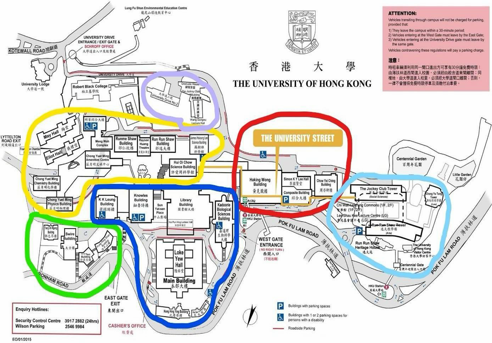
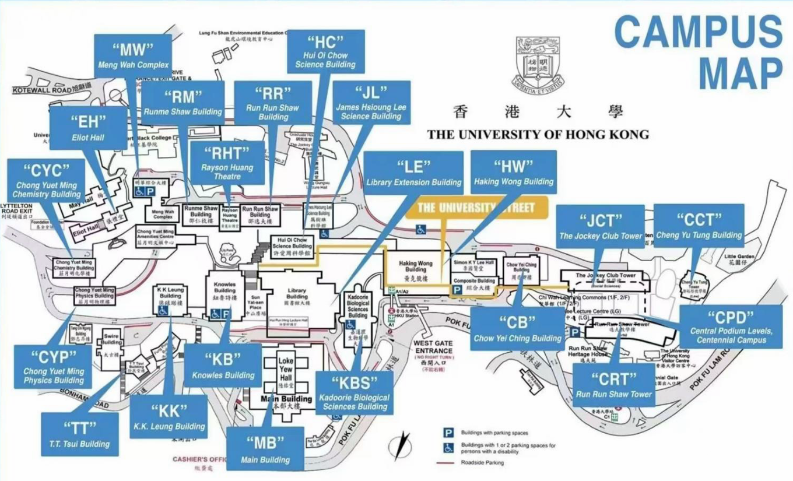
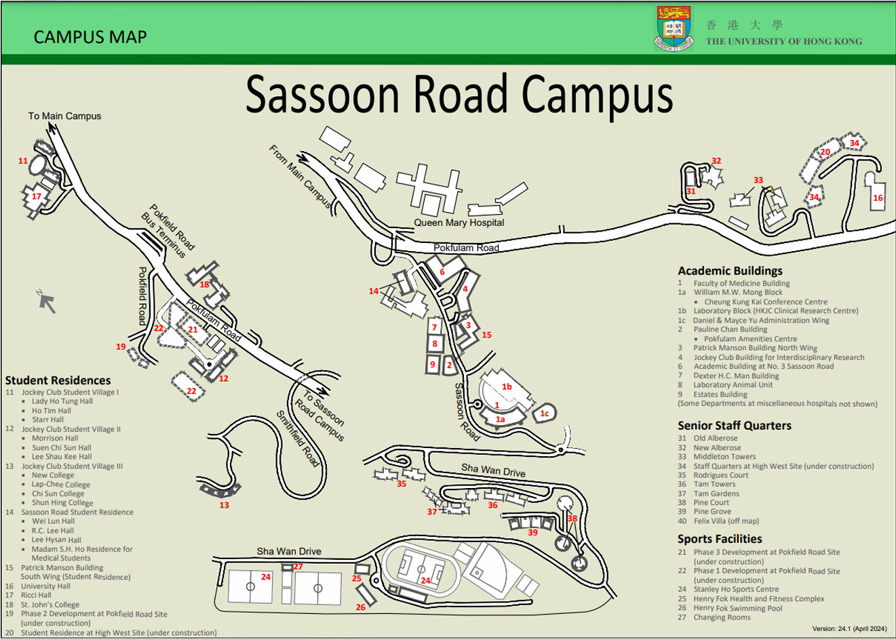

# 校园及地点指南

## 一、本部校园和百周年校园 Main Camus & Centennial Campus

<table data-header-hidden><thead><tr><th width="150.11111450195312"></th><th></th><th></th></tr></thead><tbody><tr><td><strong>代号 (Code)</strong></td><td><strong>英文名称 (English Name)</strong></td><td><strong>中文名称 (Chinese Name)</strong></td></tr><tr><td>CYM</td><td>Chong Yuet Ming Amenities Centre</td><td>庄月明文娱中心</td></tr><tr><td>CYC</td><td>Chong Yuet Ming Chemistry Building</td><td>庄月明化学楼</td></tr><tr><td>CYP</td><td>Chong Yuet Ming Physics Building</td><td>庄月明物理楼</td></tr><tr><td>EH</td><td>Eliot Hall</td><td>仪礼堂</td></tr><tr><td>RM</td><td>Rumme Shaw Building</td><td>邵仁梅楼</td></tr><tr><td>HC</td><td>Hoi Oi Chow Science Building</td><td>许爱周科学馆</td></tr><tr><td>MW</td><td>Meng Wah Complex</td><td>明华综合大楼</td></tr><tr><td>RR</td><td>Run Run Shaw Building</td><td>邵逸夫楼</td></tr><tr><td>GH</td><td>Graduate House</td><td>研究生堂</td></tr><tr><td>WLGH</td><td>Wang Gungwu Theatre (Graduate House)</td><td>王赓武讲堂</td></tr><tr><td>CB</td><td>Chow Yei Ching Building</td><td>周亦卿楼</td></tr><tr><td>HW</td><td>Haking Wong Building</td><td>黄克竞楼</td></tr><tr><td>JCT/CJT</td><td>The Jockey Club Tower</td><td>赛马会教学楼</td></tr><tr><td>RRS/CRT</td><td>Run Run Shaw Tower</td><td>逸夫教学楼</td></tr><tr><td>CPD</td><td>Central Podium Levels</td><td>百周年校园</td></tr><tr><td>CCT</td><td>Cheng Yu Tung Tower</td><td>郑裕彤教学楼</td></tr><tr><td>HHY</td><td>Hung Hing Ying Building</td><td>孔庆荧楼</td></tr><tr><td>KA/KBSB</td><td>Kadoorie Biological Sciences Building</td><td>嘉道理生物科学大楼</td></tr><tr><td>KB</td><td>Knowles Building</td><td>钮鲁诗楼</td></tr><tr><td>LE</td><td>Library Extension Building</td><td>香港大学图书馆延伸大楼</td></tr><tr><td>KK</td><td>K.K.Leung Building</td><td>梁銶琚楼</td></tr><tr><td>MB</td><td>Main Building</td><td>主楼</td></tr><tr><td>PSL</td><td>Pao Siu Loong Building</td><td>包兆龙楼</td></tr><tr><td>TT/TS</td><td>T.T.Tsui Building</td><td>徐展堂楼</td></tr></tbody></table>

> 注意： 本部校园内课间步行十分钟基本可以来往于各教学楼课室。如果拖堂/路上拥挤，可能需要快走或小跑。

***

### 校园地图

<figure><figcaption></figcaption></figure>

<figure><figcaption></figcaption></figure>

同学们亦可在 Estates Office 官网下载校园地图：

[https://www.estates.hku.hk/campus-information/campus-map-transport/hku-campus-map](https://www.estates.hku.hk/campus-information/campus-map-transport/hku-campus-map)

***

### 沙宣道校园 (Sassoon Road Campus)

* #### 医学院教学楼（供稿：邱泽宇 B21）
* FMM: FMM William M. W. Mong Block (蒙民伟楼)
* QMH: Queen Mary Hospital (玛丽医院)
* HKJC: Jockey Club Building for Interdisciplinary Research (香港赛马会跨学科研究大楼)
* QTLT: Block T Lecture Theatre (玛丽医院 Block T 讲堂)

> 注：医学院各教室列表可在此链接查询：
>
> [https://www.med.hku.hk/medicine/staff/booking/getvenues2.php](https://www.med.hku.hk/medicine/staff/booking/getvenues2.php)

#### 牙医学院教学楼（供稿：季李祺 B21）

* PPDH: Prince Philip Dental Hospital (菲腊牙科医院)

沙宣道地图：

<figure><figcaption></figcaption></figure>

***

#### 重要提醒

> 注： 医学院、牙医学院与本部校区均有一段距离，普通的 10 分钟课间不足以抵达相关的目的地，请同学们合理安排课程，以免误课。

***

想要加入 [RIC](https://ric-hku.gitbook.io/survive-hku-manual/freshman-guide/ric-intro) 来一同为内地本科生维权益，谋福利吗？快快关注我们的微信公众号 **港大 RIC 锐克** 吧！我们将在九月发布招新信息哦～

本文作者：香港大学内地本科生权益保障组（RIC）； B21 邱泽宇 BBiomedSc（医学院部分）；B21 季李祺 BDS（牙医学院部分）；\
2026 修订作者：B27 孙皋 BA。

本文基于原新生群文件《7.1 新生来港物品清单》编写而成。

最后更新于 2026 年 8 月 8 日。

本文在知识共享 署名—非商业性使用—禁止演绎 4.0 协议（[CC BY-NC-ND 4.0](https://creativecommons.org/licenses/by-nc-nd/4.0/deed.zh-hans)）下提供。
