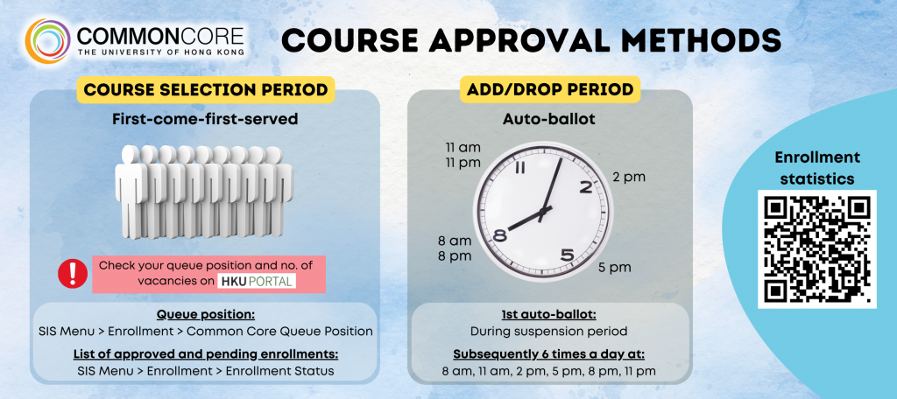

# Common Core 指南

## 一、课程内容

官方网站：[HKU Common Core Curriculum](http://commoncore.hku.hk/)

Common Core（CC）是由学生自主选择的跨学科课程，设计目的是让学生 “建立起与自己未来的联系”，理解社会议题、认识文化差异、参与社区建设、锻炼个人能力。

对于 2025–26 及以后入学的同学，所有课程分为五个不同的**探索范畴（Area of Inquiry, AoI）**，分别是：

* Scientific and Technological Literacy（编号 CCSTxxxx）
* Arts and Humanities（编号 CCHUxxxx）
* Global Issues（编号 CCGLxxxx）
* China: Culture, State and Society（编号 CCCHxxxx）
* Artificial Intelligence（编号 CCAIxxxx）

大多数同学要求上 36 学分的 CC 课程。对于这些学生，需要选择：

* 6 个 6 学分课程（覆盖所有 5 个 AoI）；或者
* 5 个 6 学分课程（覆盖所有 5 个 AoI）和 2 个 3 学分课程（任意 AoI）。

MBBS、BASc（如 Design+、AppliedAI 等）、双学位（如 BA\&LLB、BBA(Law)\&LLB 等）的同学要求上 24 学分的 CC 课程。对于这些学生，需要选择：

* 4 个 6 学分课程（覆盖任意 4 个 AoI）；或者
* 3 个 6 学分课程（覆盖任意 3 个 AoI）和 2 个 3 学分课程（同一个 AoI，不能与前述的 3 个 AoI 重合）。

## 二、课程形式

### 1. 常规线下课程 Regular F2F Courses

* 6 学分
* 编号 CCXX90xx

这些课程的教学、考核都是线下的。

### 2. 线上课程 Fully Online Courses

* 6 学分
* 编号 CCXX50xx

这些课程的教学、考核都是线上的。但是，教学活动会在固定时间进行。


**最多**可以修读 **2 门** 线上课程（**12 学分**）。


### 3. 微证书课程 Microcredential Courses, CCMCs

* 3 学分
* 编号 CCXX50xx

是教学形式非常紧凑的一种课程，在夏季学期（Summer Semester）提供。

选择修读 CCMC 的话，必须修读 2 个，以替代一个 6 学分的常规课程。

## 三、选课相关

### 1. 选课相关资料

* 对于 CC 课程，每个 Subclass 的人数限制（Quota）、空缺数量（No. of Vacancies Available）、等待批准人数（No. of Applicants Waiting for Approval）可以在以下页面看到：[Common Core Course Enrollment Statistics for Students](https://sweb.hku.hk/ccacad/ccc_appl/enrol_stat.html)；
* （正常选课期间选择了 CC 课程后）等待审批时，可以在 HKU Portal 里选择 Course Enrollment > Common Core Queue Position（简体中文：课程记录 > 核心课程等待名单），查看自己的排队位次。
  * 位置数低于剩余名额，表示能够成功选上；
  * 位置数高于剩余名额，则很可能选不上，除非排在前面的人退选该课程；正常选课期间结束后，等待列表（Waiting List）会被删除，未能成功选上的学生会被系统自动 Disapprove。

### 2. 选课要求

* **一个学年**的第一、第二学期所选的 CC 课程，总共**不得超过 24 学分**；
* 不能选择 **多于 2 个** 同一 AoI 的课程；
* 不能同时选择 [Non-Permissible Combinations](https://commoncore.hku.hk/non-permissible-combinations/) 列出的相冲突的课程；
* 不能有时间冲突（Time Clash）；
* 标有 “X” 的 Subclass（如 CCST9003-1A**X**）是预留给交换学生的，本校学生不能选择。

## 四、课程审批

<figure><figcaption></figcaption></figure>

### 1. 正常选课期间

正常选课期间采用先到先得（First-Come-First-Served）原则。

### 2. Add/Drop Period

Add/Drop Period 期间采用自动抽签（Auto-Ballot）形式。

第一次抽签在暂停期（Suspension Period）期间；此后每天 8:00、11:00、14:00、17:00、20:00、23:00 进行。

## 五、Clusters 和 Transdisciplinary Minors（非必须）

同学可以选择按照兴趣，参加来自相同 Thematic Cluster 的 CC 课程。

Thematic Cluster（主题领域）有 5 个：

* Sustaining Cities, Cultures, and the Earth (SCCE) 可持续城市、文化与地球
* The Quest for a Meaningful Life (UQM) 对有意义生活的追求
* Creative Arts (CA) 创意艺术
* The Human Lifespan (HL) 人类生命周期
* Gender, Sexuality, and Diversity (GSD) 性别、性、多样性

各主题领域的具体课程列表，详见：[Common Core Thematic Clusters | HKU Common Core](https://commoncore.hku.hk/thematic-clusters/)

在某一个主题领域完成 24 学分 CC 课程后，该主题领域对应的 Common Core Cluster 就可以被记录到成绩单上。


如果可以满足多于一个 Thematic Cluster（主题领域），可以选择其中一个记录到成绩单。


同时，也会具备申请（Declare）该主题领域对应的 Common Core Transdisciplinary Minor（CCTM）的资格。申请 CCTM 后，可以在选修对应领域的课程时，拥有优先权。

## 六、GGPA 计算特别规定

Graduation Grade Point Average（GGPA）有两种计算方案：

* 选取 GPA 最高的 5 门 CC 课（覆盖所有 AoI）；或
* 全部六门 CC 课。

GGPA 取较高的结果。这一特别规定旨在鼓励同学勇于承担风险、进行探索性学习。


该规定不适用于：

* 通过 Advanced Standing 免除了部分 CC 课程学分的学生；
* 通过 Credit Transfer 等，使得其中一/多门 CC 课程的等级是 Pass/Fail，而非字母等级（Letter Grade）的学生；
* 本身不需要 36 学分 CC 课程的学生。


详情请见：[Special Common Core Proviso in the Determination of the Graduation Grade Point Average | HKU Common Core](https://commoncore.hku.hk/special-proviso/)

## 七、Advanced Standing 与 Credit Transfer

政策详情：[Advanced Standing and Credit Transfer | HKU Common Core](https://commoncore.hku.hk/advstgcrt/)

### 1. Advanced Standing

接受 7 年中学教育的同学可以申请 Advanced Standing，免除 12 学分的 CC 课程学分：

* IB 课程、GCE ALE 课程：保证免除；
* 其他考试：视具体情况而定，按个案处理；

### 2. Credit Transfer

同学可以在任何时候，将在其他学校完成的课程的学分转入本校，这称作 Credit Transfer（转学分）。可以转入的 CC 课程学分数为要求的学分数（如 36）的 50%，同时必须满足 AoI 要求。

## 八、常见问题与解答

### Q1. 能不能把 CC 课当成 Free Elective？或者，能不能上超过要求数量的 CC 来提高 GPA？

不能。已经达到要求数量后，就不能选修多出的 CC。

因此，大家要谨慎选择心爱的 CC，多看多听。可以在 RIC 杂货铺的选课平台中查看大家对 CC 课的评价。假如实在喜欢，也可以选择 Sit In。

### Q2. 有什么方法可以更容易选上课？能不能写邮件 Argue？

和专业课程不同，CC 课的 Enroll 为确保绝对公平公正，相关 Lecturer 和 Tutor 不可以参与选课过程。

可以在 [Common Core Course Enrollment Statistics for Students](https://sweb.hku.hk/ccacad/ccc_appl/enrol_stat.html) 查看每个课程的选课人数与空位情况；在选课后也可以在 HKU Portal > Course Enrollment > Common Core Queue Position，查看自己的排队位次。

在 Add/Drop Period 期间，可以在每次抽签前查看课程是否有 Quota，及时 Add，并在相应时间点后检查自己的 Enrollment Status。如果状态为 Not Approved，记得及时将课程重新加入 Temporary List。

同时，建议多准备几门不太热门的备选 CC。

### Q3. 我看到 Subclass 1A 已经没有空位了，但 Subclass 1AX 还有。我可以选 1AX 吗？

不能。带 “X” 的 Subclass 仅供交换生选择。


如有其他问题，可查看：[Frequently Asked Questions on Common Core | HKU Common Core](https://commoncore.hku.hk/faqs)。


***

想要加入 [RIC](https://ric-hku.gitbook.io/survive-hku-manual/freshman-guide/ric-intro) 来一同为内地本科生维权益，谋福利吗？快快关注我们的微信公众号 **港大 RIC 锐克** 吧！我们将在九月发布招新信息哦～

本文作者：香港大学内地本科生权益保障组（RIC）；\
2026 修订作者：B28 周育廉 BSc；B27 孙皋 BA。

本文基于原新生群文件《6.3 CCC选课指南》编写而成。

最后更新于 2026 年 7 月 17 日。

本文在知识共享 署名—非商业性使用—禁止演绎 4.0 协议（[CC BY-NC-ND 4.0](https://creativecommons.org/licenses/by-nc-nd/4.0/deed.zh-hans)）下提供。
