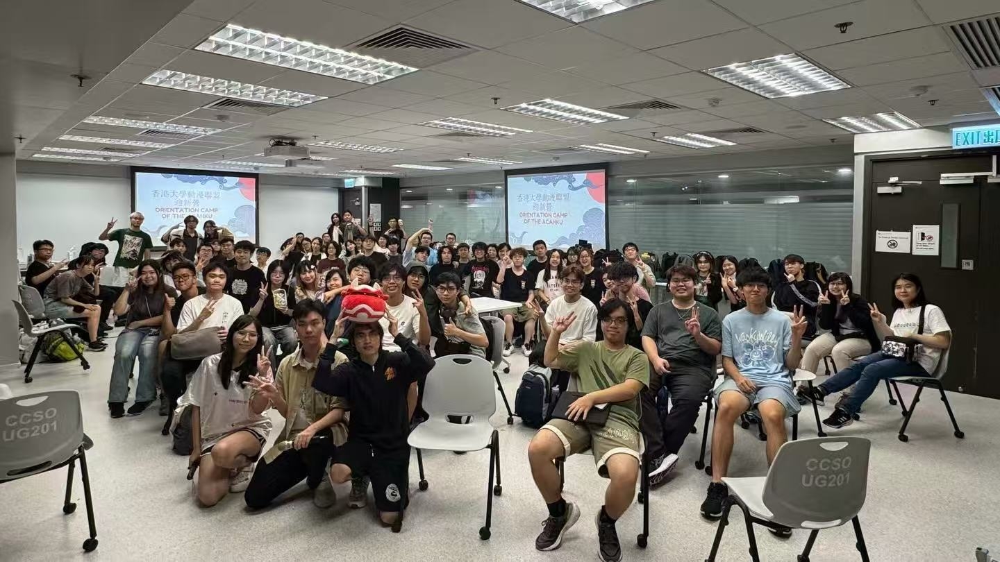
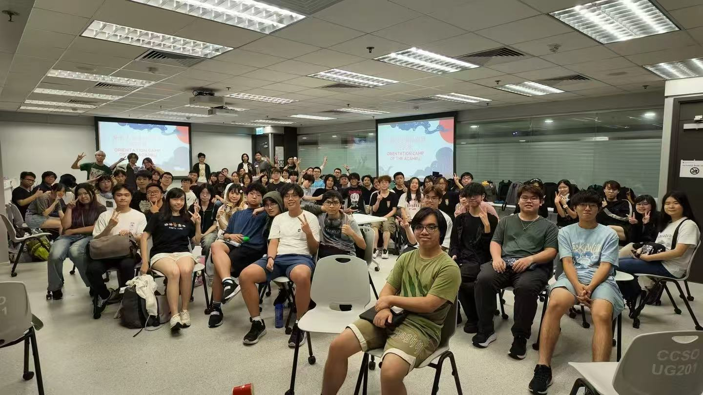
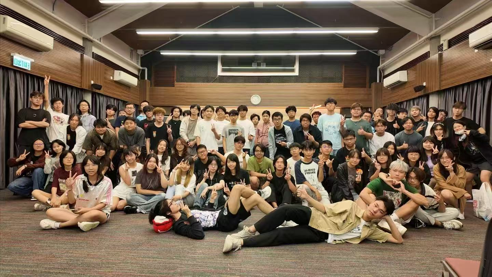
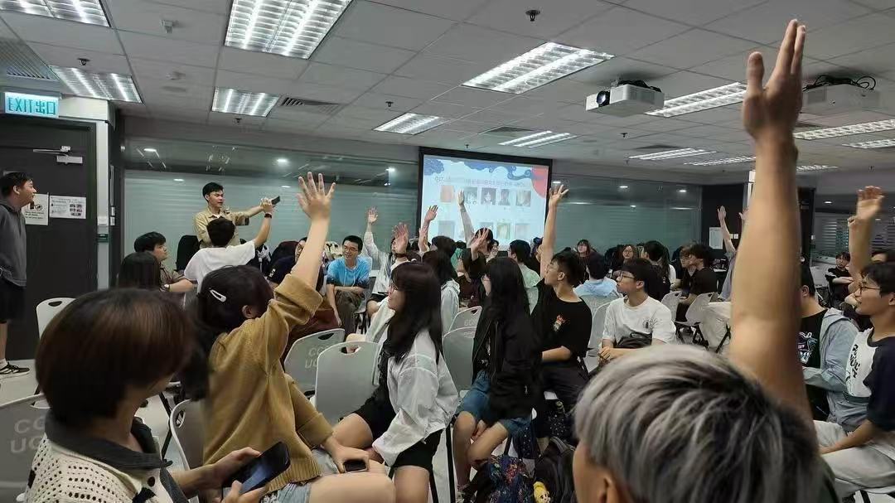

# 动漫联盟举办的 O-Camp

香港大学动漫联盟（The Animation and Comics Association, HKU，简称动漫联盟或 ACA）于 1997 年 12 月 2 日由一群热衷动漫的港大学生建立，现为香港大学文化联会属会之一。

自从成立以来，动漫联盟就致力筹办不同种类的活动，包括讲座、展览、聚会、比赛、放映会等，务求令更多人全面认识动漫文化，同时增强动漫喜好者之间的交流。

本次 O-Camp 时间为9月19-20日，持续两天一晚。我们将继续延续我们的优良传统。大家将以小组为单位，共同参与动漫知识问答和团队破冰游戏；在香港大学嘉道理中心，体验沉浸式侦探游戏（D-Game），携手揪出真凶！此外，大家还需在校园各处的 Checkpoint 完成挑战，为团队争夺积分。精力还没用完？深夜的 Wota 艺狂欢和通宵 K 聚绝对能满足你！在这里，你将结识众多志趣相投的二次元同好，为大学生活开启绚丽缤纷的序章！

报名链接：[香港大學動漫聯盟2026迎新營報名表格](https://forms.gle/xf8Pu6G4dhdkbMm96)（仅限ACAHKU会员报名参加）

<figure><figcaption></figcaption></figure> <figure><figcaption></figcaption></figure>

<figure><figcaption></figcaption></figure> <figure><figcaption></figcaption></figure>

***

本文内容由香港大学动漫联盟（ACA）提供。了解详情请参照文中信息联系社团相关负责人。

最后更新于 2026 年 8 月 28 日。
