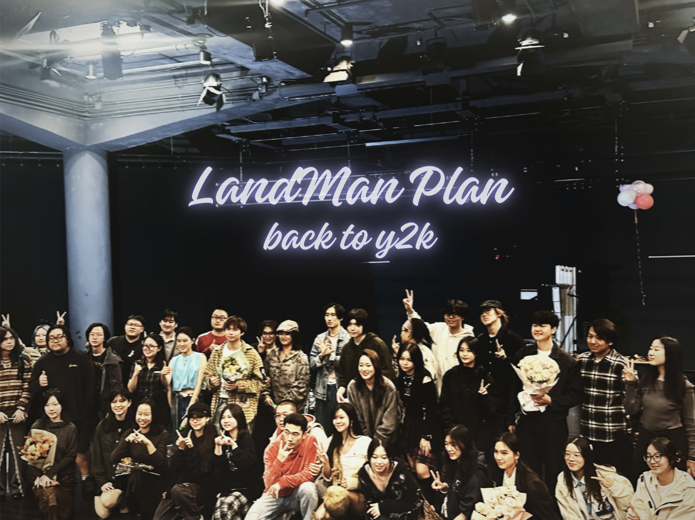

# 陆人计划 × 太平嘻院 O-Camp

<figure><figcaption></figcaption></figure>

“登陆计划” - 2026 Ocamp

港大学生乐队计划 “陆人计划” 携手香港高校说唱厂牌 “太平嘻院”，面向所有本硕博新生打造两天一夜特色 Ocamp。整个 Ocamp 以原创音乐为核心脉络，覆盖多元体验内容：

* 音乐破冰：趣味互动游戏，快速拉近新生距离；
* 海岸漫游：穿梭校园与西环，感受港岛氛围；
* 创意共创：沿路采风，打造自己的青春 “原创”；
* Live演出：享受专属迎新 Live，开启大学新篇。

在学长姐的带领下，以丰富的集体互动消解抵港的陌生，全方位熟悉校园及周边生活环境，在协作交流中结识同频好友，留存独一无二的开学初体验。

***

本文内容由陆人计划、太平嘻院提供。了解详情请参照文中信息联系社团相关负责人。

最后更新于 2026 年 7 月 28 日。
