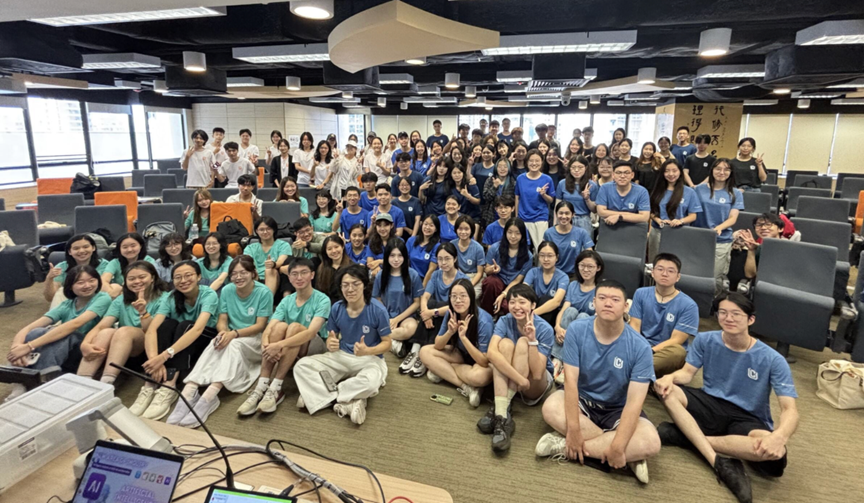

# UBCC Ocamp

香港大学商业咨询协会（UBCC）于2009 年成立，第 18 届执委会 “骦玖”秉承创始人洪圣奇先生 “做靠谱的事，成为靠谱的人”初心”，打造商科成长平台。

&#x20;

UBCC 2026 Ocamp 融合**学业**、**实战**与**社交**三大板块，一站式解锁**校园日常**、**课业规划**与**本地生活**全攻略。包含**Minicase 培训与分组实操**，帮助同学掌握案例分析思维、积累商科实战经验。仲夏夜聊2.0将由业内人士分享，分享行业信息。UBCC助力新生拓宽行业视野、在交流协作中结识同频伙伴，稳步开启港大商科成长之路。

<figure><figcaption></figcaption></figure>

社团公众号：

<figure><figcaption></figcaption></figure>
