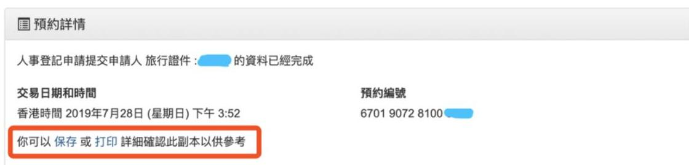

# 香港身份证办理指南


需要**获得学生签证之后**才可以预约办理香港身份证。



注：现在⽹上预约⾝份证办理名额⼗分紧缺。

根据《⼈事登记条例》，除获豁免或⽆须登记的⼈⼠外，凡年满 11 岁或以上的⾹港居⺠（包括获准在⾹港逗留超过 180 天的⼈⼠），均须登记领取⾝份证。年满 11 岁或以上并获准在⾹港逗留超过 180 天的新抵港⼈⼠须在抵港后的 30 天内登记领取⾝份证。

因此，RIC 强烈建议同学们及早进⾏预约。


## 一、预约网站：香港政府一站通

[GovHK 香港政府一站通：网上预约申领身份证(人事登记办事处)](https://www.gov.hk/sc/residents/immigration/idcard/hkic/bookregidcard.htm)


根据 [使用香港政府一站通网上服务的系统需求](https://www.gov.hk/sc/about/helpdesk/softwarerequirement/onlineservice.htm)，可以使用 Windows、macOS、Linux、iOS、Android 等常用操作系统和 Microsoft Edge、Safari、Mozilla Firefox、Google Chrome 等常用浏览器。


<figure><figcaption></figcaption></figure>

在打开的网页里，点击 **网上预约申领香港身份证(包括其后更改,取消或查询预约)及预填表格** 按钮，进入网上预约系统。

点击 **申领香港智能身份证预约服务** 中的 **预约**，开始预约。


由于系统限时 10 分钟，可提前准备好所需信息：

* 往来港澳通行证号码；
* 签证 / 进入许可申请档案编号：在发放的电子版签证 / 进入许可上，格式如 AAAA-1234567-89(0)。


<figure><figcaption></figcaption></figure>

## 二、在线填写预约信息

<figure><figcaption></figcaption></figure>

网上预约共有 5 个步骤。

### 步骤 1：输入预约资料

#### 甲部分：申请详情

在申请类别选择中依次选择 **首次登记身份证（持单程证人士除外）**、**持有效签证／进入许可的新来港人士（就读）**。

<figure><figcaption></figcaption></figure>

#### 乙部分：申请人资料


点击每一栏右侧的问号按钮，可展开更多说明。


旅行证件号码：填写往来港澳通行证号码即可。

* 根据提示，输入**最后六个数字**即可。例如，如果证件号码是 CA3273201，则填写 273201 即可。

签证 / 进入许可申请档案编号：按照签证 / 进入许可上的填写，括号中的数字填入右侧括号中。

* 编号的位置如图所示。

出生日期（日-月-年）（只需输入出生日及出生年份）

<figure><figcaption></figcaption></figure>

#### 丙部分：查询代码

自己选择一组 4 位数字代码填入。


注意选择**自己能够记住的代码**。之后更改、取消或查询预约（以及预填表格）都需要这组代码。


<figure><figcaption></figcaption></figure>

#### 丁部分：验证

填写验证码。确认本页信息无误后，点按 **继续** 进入下一步。

<figure><figcaption></figcaption></figure>

### 步骤 2：选择办理地点

选择合适的、自己能够接受的办理地点。

离港大最近的是湾仔办事处；如果可预约的最早时间过晚，或是时间不合适等，可以考虑其他较远的办事处。


从香港大学港铁站前往各办事处的交通时间（数据来源：Google 地图）：

* 湾仔（港岛）：约 20 分钟
* 长沙湾（九龙）：约 30 - 40 分钟
* 将军澳：约 50 分钟
* 火炭：约 45 分钟
* 屯门：约 55 - 75 分钟
* 元朗：约 60 - 70 分钟

以上各办事处的地址、办公时间、电话号码：[人事登记办事处 | 入境事务处](https://www.immd.gov.hk/hks/contactus/person-registration.html)


<figure><figcaption></figcaption></figure>

### 步骤 3：选择办理时间

点击 **其他日期** 查看近期预约情况；之后，点击 **位置地图** 查看办事处具体位置。

<figure><figcaption></figcaption></figure>

选定日期后，选择办理时间。

<figure><figcaption></figcaption></figure>

选择办理时间后，可以选择填入一个自己常用且方便查看的**电邮地址**，方便接收**确认通知**和**预约提示**。

<figure><figcaption></figcaption></figure>

### 步骤 4：确认

确定好预约信息无误后，点击 **确认预约及预填表格** 提交预约。

<figure><figcaption></figcaption></figure>

如果先前填写了电邮地址，点击确认后将会收到确认通知的邮件。

<figure><figcaption></figcaption></figure>

至此，身份证办理预约部分已经完成。


点击 **确认预约及预填表格** 提交预约后，步骤 5 会被自动跳过，自动进入网上预填申请书的部分。


这时，可以选择继续在网上预填申请书，也可以选择直接结束预约流程。


部分内容由于未入境香港，暂时无法填写，需入境后补填。

因此，也可以选择在抵港后再进行预填表格，或是在办事
处现场⽤提供的设备进⾏填写。


## 三、预先填写登记表格

如果不是在预约后直接开始填写登记表格，也可以直接在 [GovHK 香港政府一站通：网上预约申领身份证(人事登记办事处)](https://www.gov.hk/sc/residents/immigration/idcard/hkic/bookregidcard.htm) 中选择 **预填表格** 进行填写。

<figure><figcaption></figcaption></figure>

### 步骤 1：输入预约资料


点击右侧的问号按钮，可展开更多说明。


* 证件类型：其他旅行证件
* 旅行证件号码：预约时填写的证件号码的**最后六个数字**
* 查询代码：预约时填写的一组自己选择的 4 位数字代码

<figure><figcaption></figcaption></figure>

### 步骤 2：选择申请人

选择 **申请人 1**。

<figure><figcaption></figcaption></figure>

### 步骤 3：输入资料

#### 甲部 - 个人资料

<figure><figcaption></figcaption></figure>

* **出生地点**：内地
* **申报的国籍**：中国
* **职业**：全日制学生
* **香港住址／通讯地址（只适用於没有香港住址的申请人）**：具体填写方式见下。
* **联络电话号码**：本项不能填写空格、横线（-）等特殊符号，且不能长于 15 字符。如有需要，可以在前面加上区号 86 或 0086。

香港住址：

* 可以在 **地址查找** 处输入屋邨、楼宇名称（如李国贤堂、赛马会第一舍堂村等），然后填写楼层、单位等信息；也可以在地址搜索结果末尾（或先点击任意地址后）点击 **如系统未能显示所需的地址，请按此** 进入自行填写地址的界面。
* 如果

<figure><figcaption></figcaption></figure>

如果没有香港住址，也可以在通讯地址处填写内地住址。

<figure><figcaption></figcaption></figure>

* 香港业务地址：无需填写
* 教育程度：中学及以下
* 婚姻状况：单身

<figure><figcaption></figcaption></figure>

#### &#x20;乙部（只供没有香港居留权的申请人填写）

<figure><figcaption></figcaption></figure>

* 在港逗留条件：学生
* 获准在港逗留至（如适用）： 

乙部的香港居留权特指可以在香港永久居住的权利，因而同学们需要在港逗留条件中选择 "学生"。但是，由于获准逗留日期在未入港前无法确定，需要同学首次使用学生签证入境并拿到 一张写有批准逗留日期的入境小白条（海关人员会将小白条和签证钉在一起），因此同学们可以暂时不填写此处信息，入港后补填。在是否居于香港连续七年或以上中选"否"。丙部不适用 则无需填写，点击"继续"。

<figure><figcaption></figcaption></figure>

下图为入境小白条,红框内为批准逗留日期:

<figure><figcaption></figcaption></figure>

确认所有信息填写无误后，点击最下方的"确定"提交。提交后，可以保存一份预约详情备用。 

<figure><figcaption></figcaption></figure>

<h3 align="center">五、办理提示</h3>

1. 未满十八岁的申请者需要在父母或其他法定监护人陪同下到事务处进行身份证的申请 **（详情见下方未成年专题）**。
2. 请大家务必按照预约时间前往事务处办理；如果因故无法在预约的时间内出席，在上述网站上更改或取消预约即可，最迟在预约日期的**前一天**更改或取消。
3. 验证预约身份时可以出示最后确认时的表格，也可以提供申请使用的**旅行证件**进行验证。
4. 周六事务处只在上午办公，请同学们在预约办理身份证时注意事务处办公时间。

### 六、未成年专题

香港政府一站通网站上要求未成年人办理香港智能身份证必须有家长/监护人陪同办理。RIC就此事与入境事务处进行了沟通，入境事务处表示如非极特殊情况，还是要求家长/监护人**陪同未成年人到场办理身份证。**

如实在有特殊情况家长/监护人无法到场办理，请家长/监护人联系学校让学校方面指定临时监护人陪同学生办理。申请临时监护人的申请书须包括：

\
1\. "xxx 同学家长 xxx 授权香港大学的 xxx 作为 xxx 同学的临时监护人"\
2\. xxx 的香港身份证号为......\
3."陪同 xxx 同学办理香港智能身份证"\
4\. 家长/监护人签字

**注意：以上授权方式有不予授权或授权不被认可等风险，入境事务处强烈建议各位未成年新生 在家长陪同下办理香港智能身份证**

***

想要加入 [RIC](https://ric-hku.gitbook.io/survive-hku-manual/freshman-guide/ric-intro) 来一同为内地本科生维权益，谋福利吗？快快关注我们的微信公众号 **港大 RIC 锐克** 吧！我们将在九月发布招新信息哦～

本文原作者不详； \
2026 修订作者：B28 周育廉 BSc；B27 孙皋 BA。

本文基于原新生群文件《5.1 如何网上预约香港身份证办理及预填申请表格》编写而成。

最后更新于 2026 年 7 月 6 日。

本文在知识共享 署名—非商业性使用—禁止演绎 4.0 协议（[CC BY-NC-ND 4.0](https://creativecommons.org/licenses/by-nc-nd/4.0/deed.zh-hans)）下提供。
