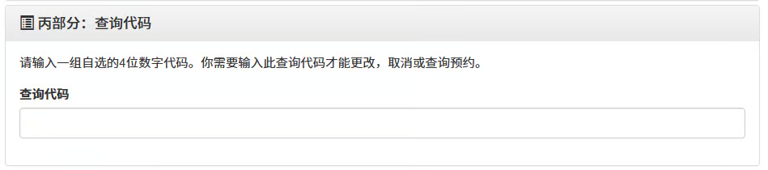
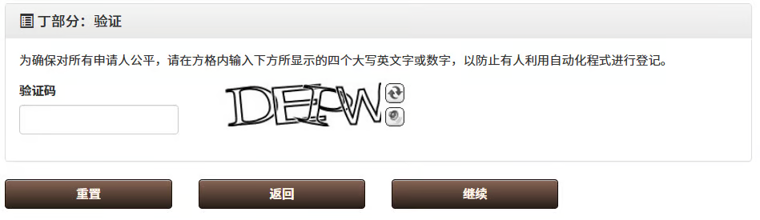
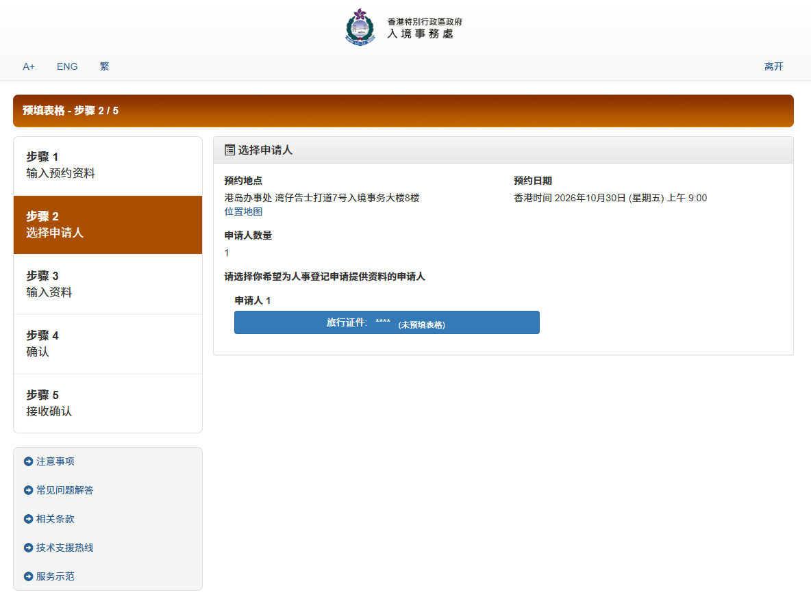
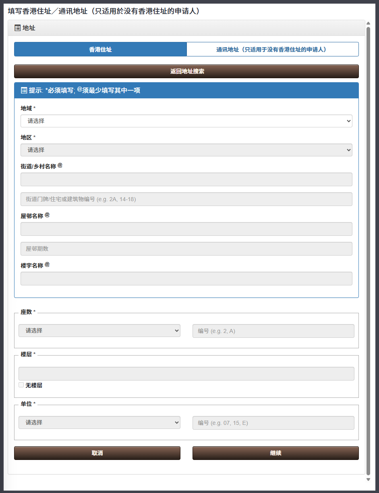

# 香港身份证办理指南


需要**获得学生签证之后**才可以预约办理香港身份证。


根据法律规定，抵港后 30 天内须登记领取身份证。因此，强烈建议同学们及早进行预约。

## 一、进入预约网站

[GovHK 香港政府一站通：网上预约申领身份证(人事登记办事处)](https://www.gov.hk/sc/residents/immigration/idcard/hkic/bookregidcard.htm)


根据 [使用香港政府一站通网上服务的系统需求](https://www.gov.hk/sc/about/helpdesk/softwarerequirement/onlineservice.htm)，可以使用 Windows、macOS、Linux、iOS、Android 等常用操作系统和 Microsoft Edge、Safari、Mozilla Firefox、Google Chrome 等常用浏览器。


<figure><figcaption></figcaption></figure>

在打开的网页里，点击 **网上预约申领香港身份证(包括其后更改,取消或查询预约)及预填表格** 按钮，进入网上预约系统。

点击 **申领香港智能身份证预约服务** 中的 **预约**，开始预约。


由于系统限时 10 分钟，可提前准备好所需信息：

* 往来港澳通行证号码；
* 签证 / 进入许可申请档案编号：在发放的电子版签证 / 进入许可上，格式如 AAAA-1234567-89(0)。


<figure><figcaption></figcaption></figure>

## 二、在线填写预约信息

<figure><figcaption></figcaption></figure>

网上预约共有 5 个步骤。

### 步骤 1：输入预约资料

#### 甲部分：申请详情

在申请类别选择中依次选择 **首次登记身份证（持单程证人士除外）**、**持有效签证／进入许可的新来港人士（就读）**。

<figure><figcaption></figcaption></figure>

#### 乙部分：申请人资料


点击每一栏右侧的问号按钮，可展开更多说明。


旅行证件号码：填写往来港澳通行证号码即可。

* 根据提示，输入**最后六个数字**即可。例如，如果证件号码是 CA3273201，则填写 273201 即可。

签证 / 进入许可申请档案编号：按照签证 / 进入许可上的填写，括号中的数字填入右侧括号中。

* 编号的位置如图所示。

出生日期（日-月-年）（只需输入出生日及出生年份）

<figure><figcaption></figcaption></figure>

#### 丙部分：查询代码

自己选择一组 4 位数字代码填入。


注意选择**自己能够记住的代码**。之后更改、取消或查询预约（以及预填表格）都需要这组代码。


<figure><figcaption></figcaption></figure>

#### 丁部分：验证

填写验证码。确认本页信息无误后，点按 **继续** 进入下一步。

<figure><figcaption></figcaption></figure>

### 步骤 2：选择办理地点

选择合适的、自己能够接受的办理地点。

离港大最近的是湾仔办事处；如果可预约的最早时间过晚，或是时间不合适等，可以考虑其他较远的办事处。


从港铁香港大学站前往各办事处的交通时间（数据来源：Google 地图）：

* 湾仔（港岛）：约 20 分钟
* 长沙湾（九龙）：约 30 - 40 分钟
* 将军澳：约 50 分钟
* 火炭：约 45 分钟
* 屯门：约 55 - 75 分钟
* 元朗：约 60 - 70 分钟

以上各办事处的地址、办公时间、电话号码：[人事登记办事处 | 入境事务处](https://www.immd.gov.hk/hks/contactus/person-registration.html)


<figure><figcaption></figcaption></figure>

### 步骤 3：选择办理时间

点击 **其他日期** 查看近期预约情况；


可以点击 **位置地图** 查看办事处具体位置。


<figure><figcaption></figcaption></figure>

选定日期后，选择办理时间。

<figure><figcaption></figcaption></figure>

选择办理时间后，可以选择填入一个自己常用且方便查看的**电邮地址**，方便接收**确认通知**和**预约提示**。

<figure><figcaption></figcaption></figure>

### 步骤 4：确认

确定好预约信息无误后，点击 **确认预约及预填表格** 提交预约。

<figure><figcaption></figcaption></figure>

如果先前填写了电邮地址，点击确认后将会收到确认通知的邮件。

<figure><figcaption></figcaption></figure>

至此，身份证办理预约部分已经完成。


点击 **确认预约及预填表格** 提交预约后，步骤 5 会被自动跳过，自动进入网上预填申请书的部分。


这时，可以选择继续在网上预填申请书，也可以选择直接结束预约流程。


部分内容由于未入境香港，暂时无法填写，需入境后补填。

因此，也可以选择在**抵港后**再进行预填表格；或者，在办理身份证当天，于人事登记办事处内使用自助设施或个人流动装置填写电子表格。


## 三、预先填写登记表格

如果不是在预约后直接开始填写登记表格，也可以直接在 [GovHK 香港政府一站通：网上预约申领身份证(人事登记办事处)](https://www.gov.hk/sc/residents/immigration/idcard/hkic/bookregidcard.htm) 中选择 **预填表格** 进行填写。

<figure><figcaption></figcaption></figure>

### 步骤 1：输入预约资料


点击右侧的问号按钮，可展开更多说明。


* 证件类型：其他旅行证件。
* 旅行证件号码：预约时填写的证件号码的**最后六个数字**。
* 查询代码：预约时填写的一组自己选择的 4 位数字代码。

<figure><figcaption></figcaption></figure>

### 步骤 2：选择申请人

选择 **申请人 1**。

<figure><figcaption></figcaption></figure>

### 步骤 3：输入资料

#### 甲部 - 个人资料

<figure><figcaption></figcaption></figure>

* **出生地点**：中国 - 内地。
* **申报的国籍**：中国。
* **职业**：全日制学生。
* **香港住址／通讯地址（只适用於没有香港住址的申请人）**：具体填写方式见下。
* **联络电话号码**：本项不能填写空格、横线（-）等特殊符号，且不能长于 15 字符。如有需要，可以在前面加上区号 86 或 0086。

<figure><figcaption></figcaption></figure>

香港住址：

* 可以在 **地址查找** 处输入屋邨、楼宇名称（如李国贤堂、赛马会第一舍堂村等），然后填写楼层、单位等信息；也可以在地址搜索结果末尾（或先点击任意地址后）点击 **如系统未能显示所需的地址，请按此** 进入自行填写地址的界面。


宿舍地址可参考 [附：各宿舍地址 | 内地、香港地址格式参考](https://ric-hku.gitbook.io/survive-hku-manual/appendices/address-format#fu-ge-su-she-di-zhi)

* 地域：香港。
* 地区：
  * 校内、一村、利玛窦宿舍、二村、圣约翰学院、三村位于中西区；
  * 沙宣道、西高山、大学堂、四村（黄竹坑）位于南区。
* 街道名称：
  * Bonham Road 般咸道；Pokfulam Road 薄扶林道；Sassoon Road 沙宣道；Lung Wah Street 龙华街；Police School Road 警校道；Ching Lin Terrace 青莲台。
* 屋邨名称：香港大学、赛马会第一舍堂村等。
* 楼宇名称：李国贤堂、何东夫人纪念堂、利玛窦宿舍、利铭泽堂、信兴学院等。
* 座数：可选择 “无座数”。
* 楼层：按实际填写。
* 单位：可选择 “室”，然后填入编号。


<figure><figcaption></figcaption></figure>

如果没有香港住址，也可以在通讯地址处填写内地住址。

<figure><figcaption></figcaption></figure>

* 香港业务地址：无需填写。
* 教育程度：中学及以下（中学）。
* 婚姻状况：单身。

#### &#x20;乙部（只供没有香港居留权的申请人填写）

<figure><figcaption></figcaption></figure>

* 在港逗留条件：学生。
* 获准在港逗留至（如适用）：可参考入境标签（俗称 “小白条”，如下图）。注意格式为 “日-月-年”。

<figure><figcaption></figcaption></figure>


入境标签是在**入境香港时**获得的。


* 旅行证件／证件种类及号码：填写港澳通行证号码。
* “你曾否通常居于香港连续七年或以上？”：否。

#### 丙部（只供已登记为选民的申请人填写）

<figure><figcaption></figcaption></figure>

无需勾选。

### 步骤 4：确认

<figure><figcaption></figcaption></figure>

确认所有信息填写无误后，点击最下方的 **确定** 提交。

### 步骤 5：接收确认

<figure><figcaption></figcaption></figure>

提交后，可以保存预约详情（图片或 PDF 文件），然后点击 **完成** 关闭窗口。

## 四、前往办事处办理、领取证件

### 1. 需要携带的文件

预约当天，携带申请时使用的**往来港澳通行证**、**入境标签**（俗称 “小白条”）、**签证**（入境许可），前往预约的办事处办理。

当天不足十八岁的同学，须同时出示**出生证明书**，并由父、母或合法监护人陪同办理申请手续。陪同办理申请手续的父、母或合法监护人，须出示其有效旅行证件（如港澳通行证、香港身份证等）。


如果在申请签证时提名了在香港的亲友作为授权监护人，则需要由该名亲友陪同办理申请手续。

如果提名了**香港大学**作为**授权监护人**，则同学**可自行前去办理**，并在办理时向批核主任等工作人员说明 “**家长已提名香港大学作为授权监护人**”。


### 2. 拍摄照片要求

由于办理时会现场拍摄照片，可以点击下面的链接，了解有关要求。

[智能身份证相片的规格 - 智能身份证 | 入境事务处](https://www.immd.gov.hk/hks/services/hkid/smartid.html#photoRequirements)

### 3. 办理流程



#### 于自助取筹机或接待处领取筹号

自动取筹机领取筹号的方法：

* 将手机或电邮收到的确认通知上的二维码放在扫描器下；或
* 在光学阅读器上放置你用作预约的身份证证明文件号码；或
* 在屏幕上输入你用作预约的身份证证明文件号码或预约编号。



### （如未网上预填）填写及提交申请表格

如果同学没有预先于网上填写表格，可使用人事登记办事处内的自助设施或个人流动装置填写及提交申请表格。



### 前往指定登记室进行登记手续

登记手续包括：

* 扫描左、右手拇指指纹；
* 拍摄照片；
* 核对申请表资料并签署。



### 等候会见批核主任

批核主任会复核申请，并发出一张申请香港身份证收据（俗称 “行街纸”）。

<figure><figcaption></figcaption></figure>

收据上会列出身份证号码、领取身份证的时间等信息。

在拿到身份证之前，这份收据可在所列日期以前作为身份证明文件。



### 4. 处理申请时间

处理身份证申请的时间一般为**五个工作天**（工作天是指星期一至星期五，公众假期除外）。一般而言，申请人可于入境事务处完成处理后的下一个工作天领取新身份证。

### 5. 领取身份证

申请人应在申请身份证收据上指定的领证期限内亲身或授权代表前往领证。

在领证时，申请人必须交还其申请身份证收据。申请人须把左、右手拇指放在扫描器上，以确定身份证内的晶片操作正常，及晶片内的个人资料正确无误。

领证时，也可以使用自助领证服务站 / 领取个人证件服务站。详情请见：[自助领证服务站/领取个人证件服务站](https://www.immd.gov.hk/hks/ic_collection_kiosk.html)。

此外，也可以授权代表领证。详情请见：[登记或补领香港身份证 | 入境事务处](https://www.immd.gov.hk/hks/services/hkid/reg_replace.html#above_18\&lastTab)。

## 五、未成年人换证

未成年时已获得儿童身份证的同学，须在 **18 岁生日后的 30 天内**登记领取**成人身份证**。如果当时身在香港以外地方，则须在**返港后的 30 天内**提出申请。

换领成人身份证时，可以使用设置于将军澳入境事务处总部的 “申请个人证件服务站”，以全自助形式办理，无需预约。地址及服务时间：[申请个人证件服务站 - 申请身份证](https://www.immd.gov.hk/hks/contactus/hq.html#12\&firstTab)。

此外，也可以在其他办事处（如湾仔）办理，预约网站：[GovHK 香港政府一站通：网上预约申领身份证(人事登记办事处)](https://www.gov.hk/sc/residents/immigration/idcard/hkic/bookregidcard.htm)；流程与前述预约流程类似，但 **申请类别** 需选择 **换领/补领身份证** - **年满 18 岁换证**。

## 六、注意事项

### 1. 登记领取身份证的法律义务

根据香港法例第 177 章《人事登记条例》、第 177A 章《人事登记规例》，除获豁免的人士外，凡年满 11 岁或以上的香港居民，均须登记领取身份证。

* 获准在香港逗留超过 180 天的**新抵港人士**必须在**抵港后的 30 天内**登记领取身份证。（第 3 条）
* 任何人士如在 11 至 17 岁期间已获签发儿童身份证，须在 **18 岁生日后的 30 天内**登记领取成人身份证。如果有关人士当时身在香港以外地方，则须在**返港后的 30 天内**提出申请。（第 6 条）
* 任何人如无合理辩解而违反上述规定，即属犯罪，可处第 3 级罚款（$10,000）及监禁 1 年。（第 19 条）

### 2. 携带和出示身份证的法律义务

根据香港法例第 115 章《入境条例》第 17C 条：

1. 任何人如年满 15 岁，是身分证持有人或是根据《人事登记条例》须申请予以登记的人，即须**时刻随身携带其身分证明文件**（通常是指身分证）。
2.  按上述规定须携带身分证明文件的人，在下述人员规定下须出示身分证明文件以供查阅 ——

    1. 任何警务人员；
    2. 任何入境事务主任或入境事务助理员；或
    3. 行政长官藉宪报刊登的命令而为此目的授权的任何人或任何界别的人，

    惟上述人员须穿着制服，或在被要求下出示获正式发给的证明文件，以证明他是警务人员、入境事务主任、入境事务助理员或是根据 (c) 段获授权的人。
3. 任何人如未能按规定出示身分证明文件以供查阅，即属犯罪，经定罪后，可处第 2 级罚款（$5,000）。
   \
   但在就本款所订罪行而进行的法律程序中，被控人如能够就未能出示身分证明文件一事提出合理辩解，即可作为免责辩护。


如未能向警务人员或入境事务处人员出示身分证明文件，即属违法。

但如在家居附近被发现没有携带身分证，却未必会被检控。

信息来源：[3. 谁人及何时需要携带香港身分证？ | Community Legal Information Centre (CLIC)](https://www.clic.org.hk/cn/topics/immigration/passports_and_identity_cards/q3)


## 七、常见问题与解答

### Q1. 我无法在预约的时间前去办理。怎么办？

如果因故无法在预约的时间前去办理，在上述网站上更改或取消预约即可。

最迟需要在预约日期的**前一天**更改或取消。

### Q2. 我预约办理 / 领取香港身份证的时间遇恶劣天气（台风、暴雨等）。怎么办？

详见：[恶劣天气时的特别安排](../appendices/hko-warning-signals.md)。

恢复服务：

* 在一般情况下，各办事处（包括入境事务处总部的自助服务站）所有服务会在八号热带气旋警告信号、“极端情况” 或黑色暴雨警告信号取消后的 2 小时内恢复正常。
* 上述警告信号如在办公时间结束前 2 小时内取消，办事处（包括入境事务处总部的自助服务站）当日便不会提供服务。
* 如恢复服务的时间预期在办事处的中午休息时段（如适用），有关服务将会在下午 2 时恢复。

预约办理当天遇恶劣天气：

* 若有关办事处的服务在八号热带气旋警告信号、“极端情况” 或黑色暴雨警告信号取消后恢复正常，你可在**往后日子的服务时段内**前往有关办事处作出其他安排而**无须重新预约**。
* 届时，你应携同原本的网上预约通知书（如有）或提供电话预约参考编号以便跟进。
* 服务轮候时间将视乎当日情况而可能较长。避免人多挤迫，你**无须**急于在警告信号取消翌日到有关办事处办理。详情请留意政府最新的新闻公报。

领取香港身份证：

* 领取香港身份证的期限一般为 1 个月。你可以在领证期限内的办公时间领取证件。
* 如今天是你领取身份证期限的最后一天，你可在八号热带气旋警告信号、“极端情况” 或黑色暴雨警告信号取消后，在**其后的工作日**前往有关办事处领取证件。

### Q3. 我在预约办证的日子未满 18 岁，而我的家长无法陪同。怎么办？

在申请学生签证时，同学已向 AO 提交监护人提名书（Guardian Nomination form）。AO 将会把此份文件交予 ImmD 作记录。

如果在申请签证时提名了在香港的亲友作为授权监护人，则需要由该名亲友陪同办理申请手续。

如果提名了**香港大学**作为授权监护人，则同学**可自行前去办理**，并在办理时向批核主任等工作人员说明 “**家长已提名香港大学作为授权监护人**”。

### Q4. 我抵港 30 天内已经没有可供预约的时间了。怎么办？

建议：

* 及时预约能约到的最近日期；
* 平时如果遇到警察检查身份证，可以：
  * 出示签证（及港澳通行证、入境标签 / “小白条”）代替；
  * 同时，解释预约困难的问题，并表明自己已经预约好某一天的身份证办理，目前还在等待。

### Q5. 香港居民身份证上的数字、字母等符号都是什么意思？

关于香港身份证的历史、防伪特征、设计等，可参考：[智能身份证 | 入境事务处](https://www.immd.gov.hk/hks/services/hkid/smartid.html)。

正面信息：

<figure><figcaption></figcaption></figure>

***

想要加入 [RIC](https://ric-hku.gitbook.io/survive-hku-manual/freshman-guide/ric-intro) 来一同为内地本科生维权益，谋福利吗？快快关注我们的微信公众号 **港大 RIC 锐克** 吧！我们将在九月发布招新信息哦～

本文作者：香港大学内地本科生权益保障组（RIC）；\
2026 修订作者：B28 周育廉 BSc；B27 孙皋 BA。

本文基于原新生群文件《5.1 如何网上预约香港身份证办理及预填申请表格》编写而成。

最后更新于 2026 年 8 月 4 日。

本文在知识共享 署名—非商业性使用—禁止演绎 4.0 协议（[CC BY-NC-ND 4.0](https://creativecommons.org/licenses/by-nc-nd/4.0/deed.zh-hans)）下提供。
