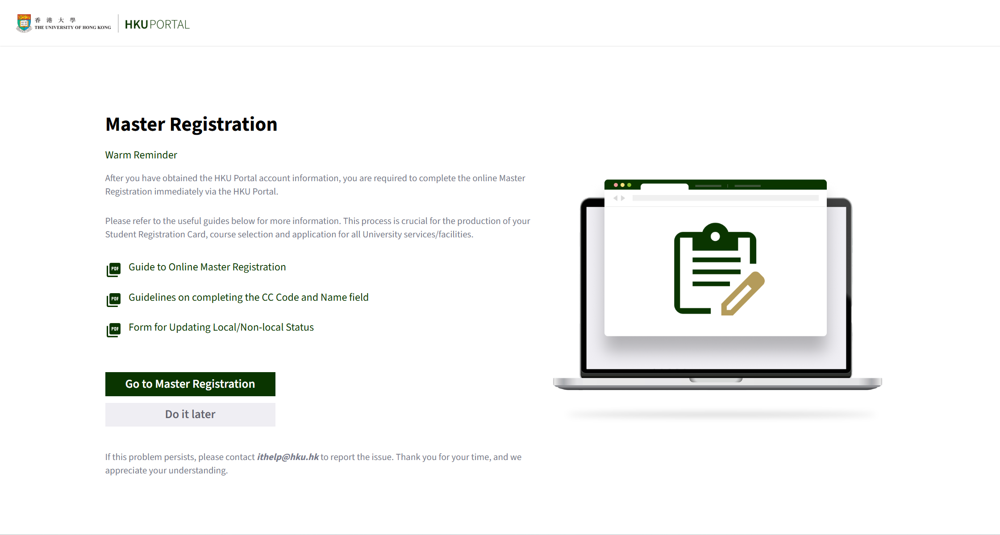
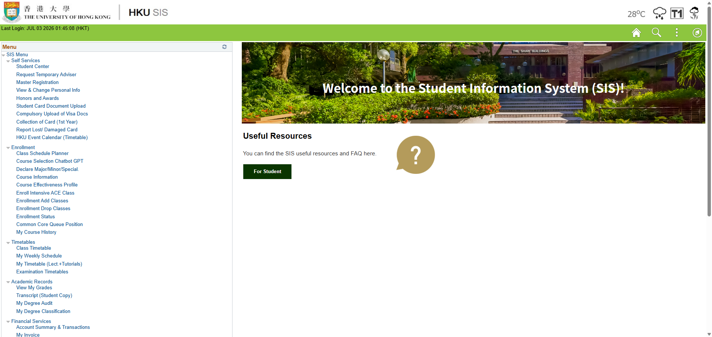

# Master Registration 指南

## 一、邮件信息

学校会在核验完入学所需文件后，在 7 - 8 月，向申请入学用的邮箱发送标题为 **Registration for New Full-time Undergraduate Students** 的邮件。

这其中有关于 Master Registration（新生注册）的信息。


新生需要在**收到邮件后 3 天内**完成 Master Registration（新生注册）。


在完成 Master Registration 之后，同学们便可以开始把个人信息记录到港大的内联网系统（HKU Portal）中了。之后选课、查看课程信息、查看成绩等操作都要通过 Portal 进行。

这封邮件在最下方，有 **COMPUTER ACCOUNT DETAILS** 部分，包含以下内容：

* 个人信息：
  * 学生姓名 Student Name
  * 学生编号 University Number（U. No.）：十位数字，格式 303xxxxxxx
  * 所属学院 Faculty
  * 修读课程 Curriculum
* HKU Portal 账户信息：
  * UID（用户 ID）：八位，格式 u3xxxxxx
  * 初始密码 Initial PIN（之后必须进行更改）
  * HKU Portal URL：[http://hkuportal.hku.hk/login.html](http://hkuportal.hku.hk/login.html)
  * 电子邮箱地址 Email Address：格式 u3xxxxxx @ connect.hku.hk


Programme 处标的 (4) **不表示学生的修业时长（Programme/Course Duration）是四年**，而是表示 “学制”。

2012 - 13 学年开始，香港的大学本科教育由传承自英国的三年制（3-Year Curriculum）改制成与世界其他地区一致的四年制（4-Year Curriculum）。为了区分不同学制的课程和项目，引入了这个标识：(3) 表示学生就读的项目是三年制；(4) 表示四年制。&#x20;

（此处的 “学制” 不代表实际修业时长。例如：MBBS 在三年制下需读 5 年，而四年制下为 6 年。）&#x20;

因此，现在所有本科生项目此处一般都是 (4)。

详情请见：[SIS Glossary - Student Information System (SIS)](https://intraweb.hku.hk/reserved_1/sis_student/sis/SIS-glossary.html)（需登录 HKU Portal）


## 二、名词解释

* **University Number**（U. No.）：**学生编号**。是之后学生证（Student Registration Card）上的编号。
* **HKU Portal UID**：HKU Portal、学生资讯系统（SIS，Student Information System）、图书馆系统等学校各种电脑系统里的**用户 ID**。
  * 默认为 uxxxxxxx（数字部分即 University Number 的第 3 - 9 位）。


自 2025 年 8 月 7 日起，UID **不能更改**（无论是否在完成 Master Registration 后七天内）。&#x20;



学校官方及非官方的部分表格在收集个人信息时，可能会用 UID 指代 University Number。这时，填 303xxxxxxx 这个学生编号。

一般来说，如果不是在登录电脑系统，而是在**填写表格**等，则 **UID 很可能是指代 University Number**。


* **HKU Portal**：**内联网**。内有课程记录、学术记录、财政服务、网上申请等服务。学校相关的很多操作与申请可以在这里完成。

<figure><figcaption></figcaption></figure>

* **HKU Portal PIN**：学校各种电脑系统里的**密码**。
  * 如需修改，可在 HKU Portal 里选择 IT Support > HKU Portal PIN Change（简体中文：资讯科技服务 > 更改 HKU Portal 密码）。
* **HKU Portal Email** (HKU Email)：**校园电子邮箱**。邮箱地址为 UID 加上 "@ connect.hku.hk"。
  * 入学之后，学校信息、社团 / 活动推广、与学校部门联系、与教师联系等都需要使用这个邮箱。
  * 由 Microsoft 提供。因此，可以[使用 Outlook 登录](https://outlook.office365.com/mail/)。在手机等移动设备上，可以[使用 Outlook 应用](https://www.microsoft.com/zh-cn/microsoft-365/outlook-mobile-for-android-and-ios)。
  * 也可以通过在 HKU Portal 里选择 My Services > My Email（简体中文：我的服务 > 我的电邮）来打开。


获得校园邮箱后，学校将通过这一校园邮箱向学生通知重要信息，并作为主要的沟通渠道（而非先前申请时使用的个人邮箱）。因此，需时常关注校园邮箱。



2026 - 27 学年及以后入学的新生的 UID@connect.hku.hk 电子邮箱地址**仅在就读期间有效**。

如果在未完成学业的情况下离开学校，将无法再访问 UID@connect.hku.hk 邮箱账户。

毕业后，发送到 UID@connect.hku.hk 邮箱的邮件将在一年内自动转发至 UID@graduate.hku.hk 邮箱；**毕业生有权长期使用该 UID@graduate.hku.hk 邮箱**。


* **Email Alias**：上述邮箱的**别名**（第二个地址），也可以用来收发邮件。
  * 可以选择修改成与自己的姓名等信息相关的，方便识别和记忆。
  * 如需修改，可在 HKU Portal 里选择 New Student > Change of Email Alias（简体中文：新注册学生 > 更改电子邮件别名）。


修改 Email Alias 不改变 HKU Portal UID。登录各种系统时，仍然需要使用 HKU Portal UID。


* **Sender Name**：用上述邮箱收发邮件时显示的 “发送人”、“收件人”。
  * 默认为邮箱地址，格式 u3xxxxxx @ connect.hku.hk。
  * 如果修改过 Email Alias，会自动变更为 \[Email Alias] @ connect.hku.hk。
  * 可以选择修改成与自己的姓名等，方便识别。
  * 如需修改，可在 HKU Portal 里选择 IT Support > Name/Email Address Registration in Mail（简体中文：资讯科技服务 > 注册电邮名字/地址）。

## 三、Master Registration 步骤

### 1. 登录 HKU Portal

使用邮件中提供的电子邮箱地址 u3xxxxxx @ connect.hku.hk 和 HKU Portal PIN 登录 HKU Portal。

HKU Portal：[http://hkuportal.hku.hk/login.html](http://hkuportal.hku.hk/login.html)

<figure><figcaption></figcaption></figure>


在首次登录时


### 2. 进入 Master Registration

通过自动弹出的页面，点击 **Go to Master Registration**；

<figure><figcaption></figcaption></figure>

或者，在 HKU Portal 里选择 Student Information System (SIS) 打开学生资讯系统后，在左侧菜单栏中，选择 SIS Menu > Self Services > **Master Registration**。

<figure><figcaption></figcaption></figure>

### 3. 填写相关信息

官方指导：[Guide to Online Master Registration](https://ase.hku.hk/mr2026/sr/61_426_onlineMR.pdf) (PDF)


表格一共 6 页：第 1 - 5 页用于输入信息，第 6 页为确认页。

第 1 - 5 页每一页填写之后，点击 **Save & Next**；

最终在第 6 页确认之后，点击 **Submit**。


#### 第 1 页

1. 在开始填写表格前，需勾选页面顶端的选择框（表示同意学校获取自己的个人信息）。
2. **Personal Particulars - Biographical** 个人信息：自动填写。无需更改，也不能更改。
3. **Name** 姓名
   * **Name Prefix** 头衔 / 称谓：男性选择 Mr.；女性选择 Miss 或 Ms.。
   * **Surname** 姓、**Other Name** 名：必须与往来港澳通行证（或护照、香港身份证等官方文件）上的相同。


内地居民的姓名在官方文件的英文写法中**一般没有空格**，且没有隔音符号（'）。

因此，在输入时，**不要在两个字的拼音间空格**。例如：

* 王建国 WANG, Jianguo
* 上官晓月 SHANGGUAN, Xiaoyue
* 吴兴恩 WU, Xingen

但是，如果不是内地居民，则需要以官方文件上的英文写法为准。可能的情况如：

* （港）陳大文 CHAN, Tai Man（或 CHAN, Tai Man Joseph 等）
* （台）張志明 CHANG, Chih-ming



关于女性称谓：

* Miss 小姐，适用于未婚女性、年轻女孩或女学生；
* Mrs. 夫人 / 太太，适用于已婚女性，通常跟着丈夫的姓；
* Ms. 女士，适用于不愿意强调婚姻情况（或不清楚）的女性。

（其他称谓：Dr. 博士
；Hon. 阁下；Ir. 注册工程师；Lady 女勋爵
；Lord 勋爵；Prof. 教授；Rev. 牧师；Sir 爵士；Ven. 尊者；等）


4. **CC Code of your Chinese name** 中文姓名电码
   * 如果没有香港身份证，此项留空即可。
   * 如果有香港身份证，此项填写上面的中文姓名电码（见下图）。输入之后，点击 Display Chinese Name，确认实际汉字。

<figure><figcaption></figcaption></figure>

#### 第 2 页

1. **HKID Number** 香港身份证号码：如果没有香港身份证，此项留空即可。
2. **Passport** 护照：填写**往来港澳通行证号码 / 护照号码**。
   * **Issuing Country** 发行国：CHN 中国
3. **ID No. of Home Country** 本国身份证件号码：如果有内地的居民身份证，填写**公民身份号码（身份证号）**。否则留空。
   * **Issuing Country** 发行国：CHN 中国
   * **National ID Type** 身份证件类型：NID 居民身份证
4. **Place of Residence/Household in Mainland China** 内地的居住地 / 户口所在地：**来自内地的同学必须填写**。否则留空。
5. **Type of Visa/Entry Permit Required to Study in Hong Kong** 来港就读所需签证/入境许可类型：此项供同学确认本地 / 非本地身份。
   * 需要学生签证来港就读的同学，选 Student Visa / Entry Permit；通过受养人签证来港的同学，选 Dependant visa / entry permit。
   * 有关本地 / 非本地身份的具体定义，请参照：[本地及非本地学生的定义](https://ric-hku.gitbook.io/survive-hku-manual/appendices/local-definition)。
   * 如果与实际情况有所出入，请在完成 Master Registration 之后，尽快通过 [Request to Update Local/Non-local Status](https://ase.hku.hk/doc/localstatus_update.pdf) 表格更新相关信息，并告知所属学院。
6. **Marital Status** 婚姻状态：**Single** 未婚
7. **Place of Birth** 出生地：内地同学为 CHN 中国。
8. **Place of Permanent Right of Abode** 永久居留权所在地：内地同学为 CHN 中国。
9. **Country of Legal Nationality** 国籍：内地同学为 CHN 中国。
   * 持香港特别行政区护照（HKSAR Passport）、英国国民（海外）护照（BNO Passport）或香港特区签证身份书（D.I.），且未持有其他国家有效护照的人，应选择 Hong Kong (SAR) of PRC。
10. **Type of Disability** 残障类别：如有，则填写具体类别；如无，则留空。

#### 第 3 页

1. **Contact Address (in English)** 联系地址（英文）：需为香港地址。
   * 如暂无且本项不能留空，可以先任意填写；获得香港地址后，需要再在系统中补上。
2. **Home Address (in English)** 家庭住址（英文）：填写家庭住址。
   * 有关英文地址的填写，可参考：[内地地址 | 内地、香港地址格式参考](https://ric-hku.gitbook.io/survive-hku-manual/appendices/address-format#yi-nei-di-di-zhi)。
   * 需写明所在国家 / 地区（P. R. China）。
   * 这一地址在第二年申请宿舍续住时会用于计算距离，所以**需填写真实地址**。
   * 每行限制 40 个字符。
3. **Address in Chinese** 家庭住址（中文）：内地同学填写中文的家庭住址。


Address 1 - Address 3 这三行用来填写**一个地址**，而非一行填写一个。

如无必要，**不需要把三行全部写满**。


4. **Contact Phone Number** 联系电话：如果不是香港电话号码，需加上区号（+86 或 0086）。
5. **Hong Kong Mobile Phone Number** 香港手机号码
   * 如暂无，可先留空；获得后在系统中补上。
   * 不需要输入括号、短划线等特殊符号，格式如 12340000 即可。
   * 学校可能在缴费等重要事项告知时，同时向这个号码发送短信。
6. **Home Phone Number** 家庭电话：如果不是香港电话号码，需加上区号（+86 或 0086）。

#### 第 4 页

1. **Emergency Contact** 紧急联络人：选择一个紧急联络人，填写其姓名、关系、地址、联系电话。
   * 地址、电话的注意事项同上。

#### 第 5 页

1. **Bank Account Information** 银行账户信息：必须是香港的银行账户。
   * 如暂无，可先留空；获得后在系统中补上。
   * 这一账户会是学校发放奖学金等的渠道。

#### 第 6 页

确认所有信息。确认无误后，按 Submit 提交。


除了地址、电话及银行账户外，**其他信息均无法在线上修改**。

提交前请再三检查**姓名、证件号码等重要信息**。


完成后，可以先关闭系统。10 分钟后，即可开始使用 HKU Portal 的全部功能。

此外，完成 Master Registration 后，可以开始 [上传学生证所需材料](student-card.md) 了。

## 四、修改信息

如要修改：

* 称谓、姓名（英文或中文）、证件号码、婚姻状态、出生日期 / 地点、永居地、国籍等个人信息
  * 使用 [Change of Personal Particulars](https://ase.hku.hk/doc/change_of_personal_particulars.pdf) 表格，向学务办公室（Academic Services Office，ASO）提交申请。
  * 学务办公室（Academic Services Office，ASO）：
    * Room G‑04, Run Run Shaw Building（本部校园 邵逸夫楼 G/F G-04 室）
    * 工作时间：
      * 周一至周五 9:00 a.m. – 5:30 p.m.
      * 周六 9:00 a.m. – 12:30 p.m.
      * 周日、[公众假期](../appendices/2026-27-calendar.md#san-gong-zhong-jia-qi-public-holidays)、[大学假期](../appendices/2026-27-calendar.md#si-da-xue-jia-qi-university-holidays) 休息


在**取得香港居民身份证后**，需通过上述表格更新香港身份证号码（HKID Card No.）和中文姓名及电码（Full Name in Chinese - Chinese Character & CC Code）。

这一信息会出现在成绩单等。


* 地址、电话、紧急联络人信息
  * 在 HKU Portal 里选择 Useful Links & Resources > View & Change Personal Info（简体中文：常用连结 > 查看及更改个人资料）。
* 银行账户信息
  * 在 HKU Portal 里选择 Financial Services > View / Amend Bank Account Info（简体中文：财政服务 > 查看银行账户资料）。

***

想要加入 [RIC](https://ric-hku.gitbook.io/survive-hku-manual/freshman-guide/ric-intro) 来一同为内地本科生维权益，谋福利吗？快快关注我们的微信公众号 **港大 RIC 锐克** 吧！我们将在九月发布招新信息哦～

本文原作者不详； \
2026 修订作者：B28 宋恒睿 CDS；B27 孙皋 BA。

本文基于原新生群文件《5.2 Master Registration指南》编写而成。

最后更新于 2026 年 7 月 3 日。

本文在知识共享 署名—非商业性使用—禁止演绎 4.0 协议（[CC BY-NC-ND 4.0](https://creativecommons.org/licenses/by-nc-nd/4.0/deed.zh-hans)）下提供。
