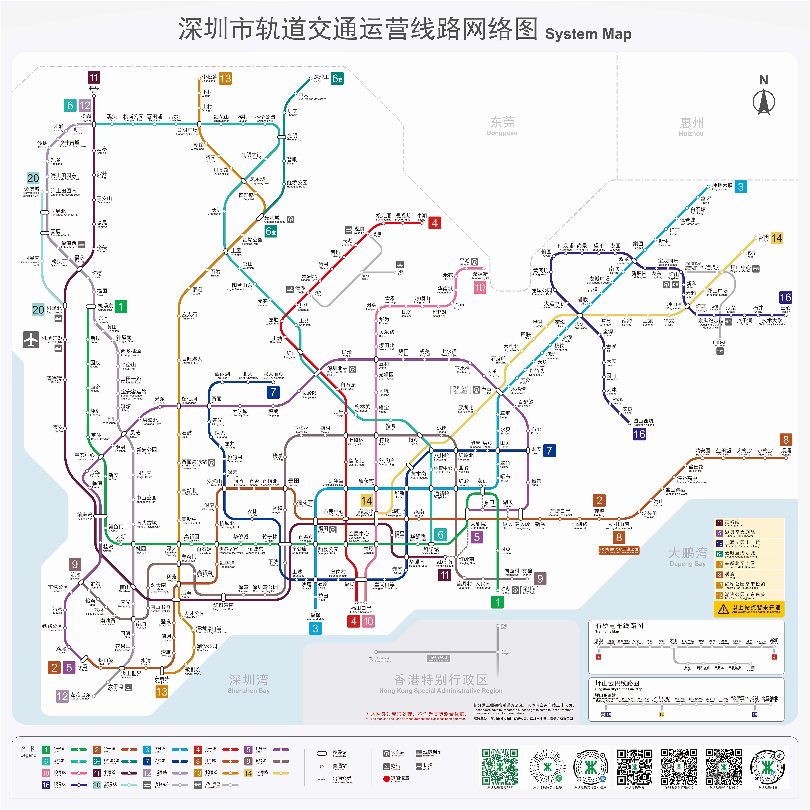

# 交通指南

### Part1 如何从深圳机场前往香港大学

### 1. 乘坐公共交通

<figure><figcaption></figcaption></figure>

#### a)经深圳湾口岸行程:

1. 在机场依照指示在深圳地铁 11 号线“机场站”上车
2. 由 “后海站” 换乘 13 号线至 “深圳湾口岸” 下车
3. 由深圳湾口岸过关
4. 过关后乘坐中旅巴士至 “上环站”
5. 由 “上环站” 乘港岛线至 “香港大学站”

所需时间：共约130分钟（深圳地铁40分钟 + 过关20分钟 + 巴士约50分钟 + 港铁约10分钟）\
花费：约 65 港币

或

1. 在机场依照指示在深圳地铁 11 号线 “机场站” 上车
2. 由 “后海站” 换乘 13 号线至 “深圳湾口岸” 下车
3. 由深圳湾口岸过关
4. 过关后乘坐巴士 “屿巴 B2P”，在 “天水围站” 下车
5. 由 “天水围站” 乘屯马线至 “南昌站”
6. 由 “南昌站” 乘东涌线至 “香港站”
7. 由 “香港站” 乘港岛线至 “香港大学站“

所需时间：共约150分钟（深圳地铁40分钟 + 过关20分钟 + 巴士约20分钟 + 港铁约70分钟）\
花费：约 50 港币

***

#### b) 经福田口岸行程：

1. 在机场依照指示在深圳地铁 11 号线 “机场站” 上车
2. 由 “岗厦北站” 换乘 10 号线至 “福田口岸” 下车
3. 由福田口岸过关
4. 过关后乘坐按照指示乘坐东铁线至 “金钟站”
5. 由 “金钟站” 换乘港岛线至 “香港大学站”

所需时间：共约130分钟（深圳地铁40分钟 + 过关20分钟 +港铁约70分钟）\
花费：约 60 港币

***

#### c) 其他方式

i) 经皇岗（24小时）/莲塘口岸：

以上口岸行程（尤其深圳湾/罗湖）也可选择在klook软件上购买跨境大巴至铜锣湾时代广场后乘坐港岛线至香港大学

\
ii) 经蛇口/其他内陆港口至港澳码头：

可步行至上环站后乘坐港岛线至 “香港大学站”，或步行至 “香港站” 后在地铁内步行至 “中环站” 乘坐港岛线至 “香港大学站”

特点：相对耗时，价格便宜

> 注：具体过关准备和过关口岸开放时间集合可查看[过关方式](immigration.md)。

***

### 2. 乘坐的士

行程: 从深圳机场打车到深圳湾口岸，由深圳湾口岸过关，再打车到香港大学

* 所需时间：35分钟(从深圳机场到深圳湾口岸) + 50分钟(从深圳湾口岸到香港大 学)
* 花费：500港币左右 特点：速度较快，省心省力，比较方便但价格高
* 特点：速度较快，省心省力，比较方便但价格高

注意：

1. 由于乘搭的士花费较高，大家可以选择结伴前往以平摊花销。
2. 把行李放在后备箱会加收每件 6 港币的费用，所以如果可以的话尽量轻车简行， 把行李放在车厢内。
3. 的士过隧道等区域均需收费
4. 大家可在 Apple Store 或者 Google Play Store，下载 APP “HK Taxi” 、 “Uber” 或 “滴滴出行”叫车及查询车费。

## Part 2 如何从珠海机场前往香港大学

### 1，乘坐公共交通

#### a) 经港珠澳大桥

行程方式一:

1. 在机场依照指示在机场大巴拱北线“珠海机场”上车
2. 在拱北口岸右侧乘坐接驳车/双层观光大巴到达港珠澳大桥珠海公路口岸
3. 乘坐金巴经港珠澳大桥到达香港口岸
4. 下车后步行至港珠澳大桥香港口岸巴士站，乘坐佐敦站-澳门巴黎人线一站，到达广东道505号
5. 步行至炮台街（佐敦道）巴士站，乘坐970到达香港大学西闸（薄扶林道）站，如果目的地为沙宣道社堂的同学可以继续乘坐970至玛丽医院站

行程方式二：

1. 在机场依照指示在机场大巴拱北线“珠海机场”上车
2. 在拱北口岸右侧乘坐接驳车/双层观光大巴到达港珠澳大桥珠海公路口岸
3. 乘坐金巴经港珠澳大桥到达香港口岸\
   下车后步行至港珠澳大桥香港口岸巴士站，乘坐城巴A22至柯士甸，佐敦道公交站，再乘 坐新巴970到达香港大学西闸（薄扶林道）站，如果目的地为沙宣道社堂的同学可以继续 乘坐970至玛丽医院站

* 所需时间：约65分钟(珠海公交) + 约30分钟(过关) + 约80分钟(巴士)
* 花费：约80港币（不含港珠澳金巴的费用）

> 注：
>
> 1. 以上提供的是花费最为便宜的路线，如果想搭乘地铁可以在旅检大楼站乘坐A33X至一\
>    号客运大楼，搭乘机场快线 (详情在Google Map里进行搜索)
> 2. 如手中没有零钱或八达通，不建议搭乘巴士，建议选择打车后到东涌站再搭乘地铁

***

### 2，乘坐的士

行程：\
从珠海机场打车到港珠澳大桥珠海公路口岸，由珠海过关，再打车到香港大学

* 所需时间：45 分钟(从珠海机场到珠海口岸) + 30分钟(从香港口岸到香港大学)
* 花费：450 港币左右

***

## Part 3 如何从香港机场前往香港大学

### 1. 乘坐巴士

有多种巴士线路可供选择，我们在这里介绍比较常见的三种

> 注：1. 建议用谷歌地图查询巴士站路线，搭配KMB软件查询巴士到达时间，会清楚不少 2. 香港巴士需要在报出下一站前按响在栏杆上的红色的下车铃司机才会停车

#### a) 乘坐 A10

行程：

1. 利希慎堂、利铭泽堂、伟伦堂附近的“玛丽医院站”以及大学堂都为 A10 停靠站，住\
   在这些地方的新生可直接在香港机场乘坐 A10 前往
2. 赛马会第三学生村（即龙华）可选择在吉席街“士美菲路站”附近下车，再步行或\
   打的士至宿舍
3. 一村/二村可以选择乘坐A10/A11/A12到西区海底隧道收费广场站，再转乘970/970X\
   分别到“何东夫人堂”（一村）/“蒲飞路巴士总站”（二村）下车，下车后过马路即可看到舍堂村

* 乘坐地点：机场巴士站
* 所需时间：大约1 小时
* 花费：50 港币左右

特点：

1. 花费较低
2. 每半小时一班车，有时比较难等到，并且乘车时间可能因路况而有波动
3. 存放行李较为方便

从机场出发的首末车时间：本日06:50-次日00:20

#### b) 乘坐 N11（仅限夜间）

行程：

乘坐至“中环（港澳码头）站”下车，再乘的士至目的地

* 乘坐地点：机场巴士站
* 所需时间：大约1 小时
* 花费：32.1 港币（N11）+约 40 港币（的士）
* 特点：\
  夜间可乘坐的巴士

从机场出发的首末车时间：01:50-04:50

#### c) 乘坐 S1+港铁东涌线

行程：

1. 在香港机场乘搭S1 巴士前往东涌站
2. 经港铁东涌线到香港站，由香港站内换乘至中环站
3. 从中环站乘搭港岛线到香港大学站

* 乘坐地点：机场巴士站
* 所需时间：1 小时 15 分钟左右
* 花费：30 港币左右
* 特点：价格低，时间稍长，换乘步骤稍多
* 注意：大家可以下载APP"新巴城巴"查看详细线路

### 2，乘坐港铁

行程：

1. 在机场寻找“机场快线”并购票（或使用八达通）
2. 乘坐机场快线前往港铁香港站
3. 由香港站内换乘至中环站
4. 从中环站乘搭港岛线到香港大学站（住在赛马会第三学生村的同学如前往宿舍请在\
   坚尼地城下车）\
   所需时间：约35 分钟

* 花费：110 港币（机场快线）+5.7港币（港岛线）
* 特点：花费较高，比较方便
* 运营时间（从机场出发）：今日5:50-次日1:15
* 注意：机场快线有三人/四人同行车票，单价会便宜不少，可考虑与同伴一同出行。

### 3. 乘坐的士

行程：

在香港机场寻找的士站，会有工作人员安排大家上车，请选择“香港岛”方向（红色车身）的的士

* 所需时间：30分钟左右
* 花费：大约350港币
* 特点：速度较快，省心省力，比较方便但价格高

注意：

1. 由于乘搭的士花费较高，大家可以选择结伴前往以平摊花销。
2. 把行李放在后备箱会加收每件6港币的费用，所以如果可以的话尽量轻车简行，把行李放在车厢内。
3. 的士过隧道等区域均需收费
4. 大家可在 Apple Store 或者 Google Play Store，下载 APP “HK Taxi”“Uber”或使用“滴滴出行”订车及查询车费

***

_Licensed under CC BY-NC-ND 4.0. Copyright © 2026 HKURIC. All Rights Reserved._ _未经许可，禁止演绎、修改或商业用途。_
