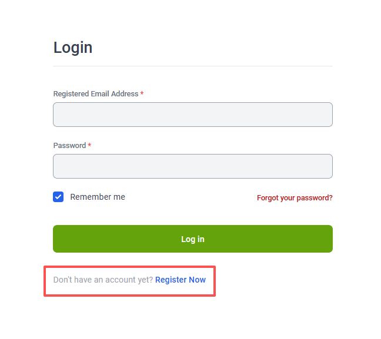

# 签证申请详细指南

## 一、官方链接

内地学生来港就读申请：[https://studentvisa.hku.hk/mainland-student](https://studentvisa.hku.hk/mainland-student)

可查看申前必读、所需文件等详细信息。此外，网页下方有**学生签证申请系统**链接。如有需要，也可查阅：

* [“申办学生签证的流程及常见问题” 简介](https://studentvisaapp.hku.hk/sites/default/files/public-uploads/HKU%20Visa%20Application%20Seminar%202026_ML_20260609.pdf)
* [官方常见问题与解答](https://www.studentvisa.hku.hk/student-visa-faq)

在签证处理过程当中，遇到任何问题都可以参考这些网页。

## 二、浏览器

多种主流浏览器都可以使用。如果发现无法正常使用，请尝试以下方法：

1. 清除 Cookies 数据（或 Empty Caches / Clear Browsing Data）
2. 更新浏览器至最新版本
3. 更换其他浏览器

此外，建议使用电脑而非平板、手机等申请。

## 三、申请步骤及说明

### 注册新账号



#### 进入**学生签证申请系统**

第一次使用签证申请系统，需要注册新账号。

<figure><figcaption></figcaption></figure>



#### **注册新账户**


签证申请过程中，系统会**通过邮件通知任何进展**。因此，请选择一个自己**正在使用、方便访问、可以时常查看**的邮箱注册账号。


<figure><figcaption></figcaption></figure>



#### 查收注册账号邮件

点击 Register 后，邮箱中会收到标题为 **HKU Student Visa - Account Registration** 的邮件。

<figure><figcaption></figcaption></figure>


如果收件箱中没有相关邮件，可以查看**垃圾邮件**。


点击邮件中的链接，跳转到设置密码的页面。

设置密码后，会显示 **Your new password has been saved**，即代表密码设置成功。



#### 选择申请类型

新生需选择 **New Student Visa Application**。


注意**选择正确的选项，后续不可修改**。


<figure><figcaption></figcaption></figure>



#### 查收下一步操作邮件

密码设置成功后，会收到标题为 **HKU Student Visa - Application Account Registration Not Complete Yet** 的邮件。

接下来，需要完成其中所述三个必要操作。

Step 1: Fill in the Applicant Information

Step 2: Settle the Application Fee

Step 3: Submit the Required Application Documents

具体细节请往下看。




注意：

1\. 一个邮箱只可以用于申请一个用户。如果此后发现填写的内容有误且无法更改，可以通过 [https://www.studentvisa.hku.hk/contact-us](https://www.studentvisa.hku.hk/contact-us) 中的方式和入学事务部（Admissions Office，AO）**说明情况**，或**用其他邮箱**再进行一次申请流程。

2\. 对于使用其他邮箱重复注册的同学：由于此前邮箱申请的用户一段时间后将会到期，你可能会收到一封邮件说你的签证申请被关闭，此时无需担心，系统关闭的是你用之前的邮箱申请的用户。


### STEP 1. 填写申请人信息 Fill in the Applicant Information

<figure><figcaption></figcaption></figure>

点击 Fill Now，开始填写个人信息。

<figure><figcaption></figcaption></figure>

如图所示，本步骤共分为五大部分，按提示用英文填写即可。


请**根据要求**填写所有的信息，因为这直接影响之后需要上传的文件。




#### 个人信息 Personal Information

说明：

* **Basic Information - National/Permanent Resident of ...**

<figure><figcaption></figcaption></figure>

内地的同学选择 **MAINLAND**。


根据签证申请网站：

如果你持有中国护照并在其他国家拥有永久居留权，你可以申请为海外学生。在香港大学签证系统注册时，请选择 MAINLAND (LIVING OVERSEAS / WITH OVERSEAS RESIDENCE)。


* **Travel Document**

<figure><figcaption></figcaption></figure>

内地居民选择 **Exit-entry Permit (for Mainland applicants)**，即往来港澳通行证。


未有申领港澳通行证的同学，可在 **Travel Document No.** 处填写 **0000**。

此时，请在 **Mainland Identity Card No.** 处填写**内地居民身份证号码**。


* **Contact Information - Correspondence Address**

通讯地址，填写家庭住址即可。

* **Emergency Contact - Relationship to Applicant**

紧急联系人与申请人关系，填写 Father、Mother 等即可。




#### 学习信息 Filling Study Information

按 **Offer 上的信息**输入即可。

说明：

* **Study Programme**

<figure><figcaption></figcaption></figure>

Faculty - Programme Name 处支持手动输入项目名称并搜索。

<figure><figcaption></figcaption></figure>

Offer Type 处，注意选择正确的类型。


**通过高考录取的内地学生，获得的是正式录取（Firm Offer）。**

通过国际考试（A-Level、AP、IB 等）录取的同学，请查看自己收到的 Offer 类型。若目前拿到的是 有条件录取（Conditional Offer），可以先申请签证，但**在拿到新的 Firm Offer 后也需要在系统中及时上传**。


* **Student Information**

<figure><figcaption></figcaption></figure>

新生 HKU Student UID 一项留空即可。

* **Financial Support**

<figure><figcaption></figcaption></figure>

按实际情况选择。


这一项选择与后续财产证明等文件有关，故请**谨慎选择**。

如选择 **I will support myself**，则**财产证明中的资产需要在自己名下**；

如选择 **I have a financial sponsor**，则**财产证明中的资产可以在财务担保人（Financial Sponsor，如家长）的名下**。同时，需要提供**财务担保人与自己关系的证明文件**（如户口簿、出生证明等）。




#### 行程安排 Travel Arrangements

按照个人行程计划填写即可。

**Expected Date of Entry to Hong Kong** 可填写**开学前 2 星期前**，即 **8 月 20 日左右**。


如果未确定具体日期，**可填写大致日期**。实际进入香港的时间**不需要与之相同**。




#### 检查信息并提交 Review Information and Submit

**确认信息是否有误**。如需要修改，则点击 Back 回到相应的页面进行修改。



#### 提交信息 Applicant Information Submitted

**信息确认无误后**点击 **Submit**，系统会自动跳转到支付签证费用的页面。



### STEP 2. 支付申请费用 Application Fee Payment

点击 **Proceed to Payment**，进行付款。

可使用的支付方式：

<figure><figcaption></figcaption></figure>


付款成功后，建议通过截图等方式**保存付款凭证**。



如果显示支付失败，但同时又进行了扣款，请截图并与 AO 说明情况；联系银行进行退款，之后重新付款。

AO 联系方式：[https://www.studentvisa.hku.hk/contact-us](https://www.studentvisa.hku.hk/contact-us)


### STEP 3. 提交文件 Applicant Documents

根据系统要求，上传所需文件的电子版：

1. 香港入境事务处申请来港就读申请表格（**ID995A**）
   * 具体填写方法及注意事项，详见 [ID995A 表格填写指南](id995a-guide.md)。
2. **申请来港就读声明**（Declaration of Entry for study in Hong Kong）：[点击下载](https://studentvisaapp.hku.hk/sites/default/files/public-uploads/01-0324_Declaration%20for%20Entry%20of%20study%20in%20HK.pdf)
3. 香港大学&#x7684;**《录取通知书》**（Offer of Admission）&#x6216;**《有条件录取通知书》**（Conditional Offer of Admission），以及：
   * **已签署的回执**（Signed Reply Slip），或
   * 系统确认截图（Screen Capture of System），或
   * 电邮确认通知信（Screen Capture of Email）等。
4. **中华人民共和国居民身份证**（Mainland Identity Card）的正、反面
5. **常住人口登记 / 户口簿**（Household Registration / Census Record）
   * 保险起见，建议将户主页、自己的信息页等一并上传。
6. 近期拍摄的**证件照片**（[相片规格](https://www.immd.gov.hk/hks/residents/immigration/traveldoc/photorequirements.html)）
7. **财产证明（Financial Proof）**
   * 如果之前选择了 **I will support myself**，财产证明须为**自己名下**。
   * 如果之前选择了 **I have a financial sponsor**，财产证明可以为**财务担保人（父母）名下**。同时，需要在系统对应位置上传：
     * 由**财务担保人（父母）**&#x7B7E;署的**财务担保人声明书（Financial Sponsor's Supporting Letter）**，可在系统中下载；
     * **财务担保人（父母）的户口簿信息页**。
   * 根据 AO 官网，入境事务处将对财产证明有严格要求。申请人或其财政资助人须有足够能力支付学费和留港日常生活费用。申请人须提交**下列其中一项文件**作为财政证明：
     1. 流动资产证明；
        * 最近 3 个月内的银行流水（银行对帐单，存折或银行存折）、储蓄 / 定期存款证明（没有冻结期限的要求）等，并带有银行印章（**不包括理财产品**）。
     2. 税收收据、工资单、聘用书；
     3. 经济援助或奖学金的奖励函（Award Letter）。
        * 如您仅获得全额**学费**奖学金，仍需提交额外的财务证明文件，以支持您在香港的**生活开支**。
   * 财产证明并未设定最低存款金额要求。根据过往经验，申请人应持有约人民币 100,000-150,000 元。


**RIC 一般建议使用存款证明，而不使用工资单。**

通常而言，开存款证明的资金会被冻结三个月左右，可以向办理银行咨询相关事项。


如果申请人**在当年入学时（9 月 1 日）仍未满 18 岁**，则**还需要以下文件**：

1. 监护人提名书（Guardian Nomination form）：[点击下载](https://studentvisaapp.hku.hk/sites/default/files/public-uploads/03-0324_%20Guardian%20Nomination%20Form.pdf) / [样表](https://studentvisaapp.hku.hk/sites/default/files/public-uploads/03-0324_%20Guardian%20Nomination%20Form%20\(Chin%20Sample\).pdf)
   * 提名书需要的在香港的授权监护人**必须**获得有效的香港身份证并且目前居住在香港。请将授权监护人的香港身份证复印件与监护人提名书一并上传（如适用）；
   * **若您没有在香港的监护人，请提名香港大学作为授权监护人。**
2. 出生证明（Birth Certificate）

***

说明：

* 文件可为 pdf docx doc jpg jpeg png 格式，但**大小不得超过 2 MB**。


如有需要，可通过软件、网站等调整图片或文件的大小。


* 上传时可能出现上传失败或速度缓慢的情况，可以尝试多次上传。
* 交上去之后的文件在最终 Submit 之前都是可以修改的。

确认提交后，将收到标题为 **HKU Student Visa - Online Application Documents Submitted** 的邮件。耐心等待 AO 审核电子版文件即可。

### STEP 4. 入学事务部处理文件 Processing by Admissions Office

如果入学事务部（Admissions Office，AO）发现上一步中的文件有**缺失**、**遗漏**的部分，会发送标题为 **HKU Student Visa - Missing/Incorrect Application Document(s)** 的邮件。此时请进入系统查看审核意见，并**重新上传**、点击 Submit 提交文件。

一般来说，**首次上传**的文件需要**最多 5 个工作日**审核；而**再次上传**的文件则会在 **3 个工作日内**审核。

如果 AO 审查后认为**电子版文件没有问题**，会发送标题为 **HKU Student Visa - Online Submitted Documents Checked** 的邮件。


自 2026 年 4 月 21 日起，为简化申请程序，**申请人无需将纸质文件邮寄至 AO**。

AO 将会直接把签证文件递交至香港入境事务处（ImmD）。

在邮件中，会写明 **"Please note that you DO NOT need to mail the application hardcopies to our office."**


一段时间后，待 AO 将文件**递交至香港入境事务处（ImmD）**&#x65F6;，系统会发送标题为 **HKU Student Visa - Application Submitted to HK Immigration Department** 的邮件。

### STEP 5. 香港入境事务处处理申请 Processing by Immigration Department

**香港入境事务处（ImmD）**&#x7684;处理时间通常为 **6 - 8 星期**。在夏季高峰期可能更长。


如果同学持有的是**有条件录取（Conditional Offer）**，此时可以**尽快将正式录取通知书（Firm Offer）上传至系统 STEP 6 位置**。


### STEP 6. 正式录取通知书提交 Firm Admissions Offer Submission

在这里上传**正式录取通知书（Firm Offer）**。


**通过高考录取的同学、**&#x4EE5;及其他**获得正式录取（Firm Offer）的同学**，**可以忽略这一步。**


### STEP 7. 获得签证 Visa Permit

**香港入境事务处（ImmD）**&#x6279;准申请后，系统会发送标题为 **HKU Student Visa - Application Approved by HK Immigration Department** 的邮件。

在**最多 5 个工作日内**，AO 将会从 ImmD 处**接收签证**，条件是：

* 现在是课程开始日期（9 月 1 日）的前 3 个月内；
* **正式录取通知书（Firm Offer）已上传并通过审核。**

AO 接收签证后，系统会发送标题为 **HKU Student Visa - Visa Permit Collected from HK Immigration Department** 的邮件。

在**最多 5 个工作日内**，AO 将会审核所接收到的签证信息是否正确。

如果正确，AO 会向同学发放签证。系统会发送标题为 **HKU Student Visa - Visa Permit Available For Download** 的邮件。

邮件中会包含一个链接。点击链接，前往 “香港政府一站通” 的下载 “电子签证” 网页。按要求输入**申请档案编号（ImmD Reference Number，包含在邮件中）**、申请人的出生日期（日-月-年）等信息后，就可以下载含有电子签证的压缩包了。


如果上述方式的链接失效，也可以在港大的签证申请系统中，点选 **STEP 7 中的 Download Visa Permit** 下载 PDF 格式的**签证、不反对通知书（NOL）**&#x7B49;文件。


压缩包中一般含有三个 PDF 文件：

* Visa XXXX-0000000-00.pdf
  * 这是 **“入境签证 / 进入许可通知书”**，也即电子签证本身。
  * 在办理港澳通行证上的逗留签注（D 签）时，需要打印这份文件，交给内地出入境部门。
  * 在入境香港时，可以将这份文件保存在手机等设备上，或者打印在 A4 纸上，与港澳通行证一起展示给入境处职员。
* Letter(1) XXXX-0000000-00.pdf
  * 这封信意在告知：签证申请已获批准，需要办理往来港澳通行证、逗留签注（D 签）。
  * 这封信主要是告知必要信息，实际用处不大。
* Letter(2)  XXXX-0000000-00.pdf
  * 这封信是 **“不反对通知书”（No Objection Letter，NOL）**。是同学以后**在港兼职、实习等的必要文件**。建议保管好这份文件。
  * 其名称来自于其中的 "Notwithstanding the above, the Director of Immigration has **no objection** to ..."（尽管有上述规定，入境事务处处长**不反对**……）

获得电子签证后，就可以向**内地出入境管理部门**申请**往来港澳通行证和 /** **或逗留签注（D 签）**&#x4E86;。具体请看：[往来港澳通行证、逗留签注办理指南](exit-entry-permit.md)


**到这里，签证申请部分就结束了。**&#x795D;大家入学顺利！


### STEP 8. 入学信息 Enrollment Details

开学一段时间后，会收到标题为 **HKU Student Visa - Complete Enrollment** 的邮件。

这封邮件意在提醒同学，进入签证申请系统，完成最后一步中入学信息的填写。

按实际情况填写：

* 就读课程 / 项目（Programme of Study）
* 学生证号（University Student No.）
* 学校邮箱（University Email）
* 预计/实际学习结束日期（Intended/Actual Study End Date）

***

想要加入 [RIC](../ric-intro/) 来一同为内地本科生维权益，谋福利吗？快快关注我们的微信公众号 **港大 RIC 锐克** 吧！我们将在九月发布招新信息哦～

本文作者：香港大学入学事务部（Admissions Office）、香港大学内地本科生权益保障组（RIC）。

本文基于原新生群文件《2.3 Online Visa Application的正确打开方式》更新而成。

最后更新于 2026 年 6 月 14 日。

本文在知识共享 署名—非商业性使用—禁止演绎 4.0 协议（[CC BY-NC-ND 4.0](https://creativecommons.org/licenses/by-nc-nd/4.0/deed.zh-hans)）下提供。
